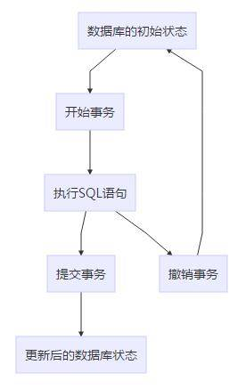

### 【1】数据库事务隔离级别
#### 1.1 事务
> **事务**：是并发控制的基本单位。所谓的事务，它是一个操作序列，这些操作要么都执行，要么都不执行，它是一个不可分割的工作单位。
> 通过`start transaction;`开启一个事务；
> 执行`insert`，`update`等操作；
> 执行`rollback`回滚上述操作。一个事务要么全部执行，要么全部不执行。
> 或者`commit`提交事务，结束。

> 上述情况，在单个用户操作数据库时往往不会出现问题，但是在多个用户并发场景下，由于**数据表中的数据是实时改变的**，事务只是控制数据的最终状态，也就是说如果**没有正确的隔离级别**，在更新操作语句结束后，即使事务未完成，其他事务就已经可以读取到改变的数据值了。
> 例如：假设用户A的事务A开始后更新了数据库数据，此时用户B开始读取该数据，用户B将会读取到了新的值。但是如果紧接着事务A在下一条SQL语句操作时产生了错误，将事务A回滚了，那么用户B读取到的数据就是错误的无效数据了。

#### 1.2 并发事务产生的问题
##### 1.2.1 丢失更新
> 定义：A事务提交时，把已经提交的B事务的更新数据覆盖了。

| 时间点 | 事务A | 事务B |
| --- | --- | --- |
| T1 |  | 开始事务 |
| T2 | 开始事务 |  |
| T3 |  | 查询账户余额为1000元 |
| T4 | 查询账户余额为1000元 |  |
| T5 |  | 取出100元把余额改为900元 |
| T6 |  | 提交事务 |
| T7 | 存入100元把余额改为1100 |  |
| T8 | 提交事务 |  |
| T9 | 余额恢复为1100元（丢失更新） |  |
> 它和不可重复读(下面介绍)本质上是同一类并发问题，通常把它看做是不可重复读的一个特例。两个或多个事务查询同一数据。然后都基于自己的查询结果更新数据，这时会造成最后一个提交的更新事务，将覆盖其它已经提交的更新事务。

##### 1.2.2 脏读
> 定义：读到未提交更新的数据

| 时间点 | 事务A | 事务B |
| --- | --- | --- |
| T1 |  | 开始事务 |
| T2 | 开始事务 |  |
| T3 |  | 查询账户余额为1000元 |
| T4 |  | 取出500元把余额改为500元 |
| T5 | 查询账户余额为500元（脏读） |  |
| T6 |  | 撤销事务，余额恢复为1000元 |
| T7 | 存入100元把余额改为600元 |  |
| T8 | 提交事务 |  |

> 现在为止:所有的数据库都避免脏读操，可以用两个Mysql会话试验一下以上的操作，**在默认的隔离级别下（REPEATABLE-READ）**，A事务在T5时刻读取到的余额为1000元，不会是500元。

##### 1.2.3 不可重复读
> 定义：读到已经提交更新的数据，但一个事务范围内两个相同的查询却返回了不同数据。

| 时间点 | 事务A | 事务B |
| --- | --- | --- |
| T1 |  | 开始事务 |
| T2 | 开始事务 |  |
| T3 |  | 查询账户余额为1000元 |
| T4 | 查询账户余额为1000元 |  |
| T5 |  | 取出100元把余额改为900元 |
| T6 |  | 提交事务 |
| T7 | 查询账户余额为900元（与T4读取的一不一致，不可重复读） |  |

##### 1.2.4 幻读
> 定义：读到已提交插入数据，幻读与不可重复读类似，幻读是查询到了另一个事务已提交的新插入数据，而不可重复读是查询到了另一个事务已提交的更新数据。

| 时间点 | 事务A | 事务B |
| --- | --- | --- |
| T1 |  | 开始事务 |
| T2 | 开始事务 |  |
| T3 | 统计用户Z总存款数为1000元 |  |
| T4 |  | 新增Z的一个存款账号，存款100元 |
| T5 |  | 提交事务 |
| T6 | 再次统计用户Z总存款数为1100元（与T4读取的一不一致，幻读） |  |

> **不可重复读和幻读的区别**： 简单来说，不可重复读是由于数据修改引起的，幻读是由数据插入或者删除引起的。
**不可重复读**:是指在数据库访问中，一个事务范围内两个相同的查询却返回了不同数据。这是由于查询时系统中其他事务修改的提交而引起的。

#### 1.3 事务隔离级别
##### 1.3.1 READ UNCOMMITTED（读未提交数据）
> 一个事务在执行过程中可以看到其他事务没有提交的新插入的记录，而且还能看到其他事务没有提交的对已有记录的更新。

##### 1.3.2 READ COMMITTED（读已提交数据）
> 一个事务在执行过程中可以看到其他事务已经提交的新插入的记录，而且还能看到其他事务已经提交的对已有记录的更新。

##### 1.3.3 REPEATABLE READ（可重复读）
> 一个事务在执行过程中可以看到其他事务已经提交的新插入的记录，但是不能看到其他事务对已有记录的更新。

##### 1.3.4 SERIALIZABLE（串行化）
> 一个事务在执行过程中完全看不到其他事务对数据库所做的更新。当两个事务同时操作数据库中相同数据时，如果第一个事务已经在访问该数据，第二个事务只能停下来等待，必须等到第一个事务结束后才能恢复运行。因此这两个事务实际上是串行化方式运行。

#### 1.4 隔离级别与并发问题

| 隔离级别 | 丢失更新 | 脏读 | 不可重复读 | 幻读 |
| --- | --- | --- | --- | --- |
| READ UNCOMMITTED | 允许 | 允许 | 允许 | 允许 |
| READ COMMITTED | 允许 | 避免 | 允许 | 允许 |
| REPEATABLE READ | 避免 | 避免 | 避免 | 允许 |
| SERIALIZABLE | 避免 | 避免 | 避免 | 避免 |

> 1. 四种隔离级别的安全性与性能成反比！最安全的性能最差，最不安全的性能最好！
> 2. mysql默认采用RR隔离级别，但是因为MySQL采用了gap lock，所以实际上MySQL的RR隔离级别也解决了幻读的问题