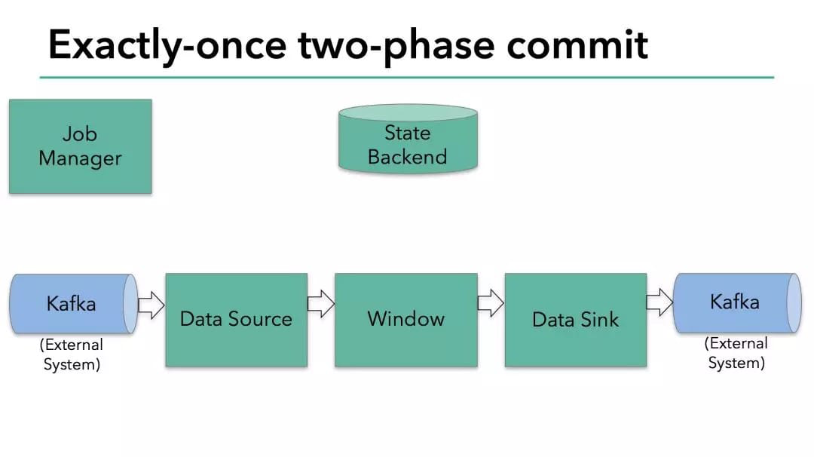
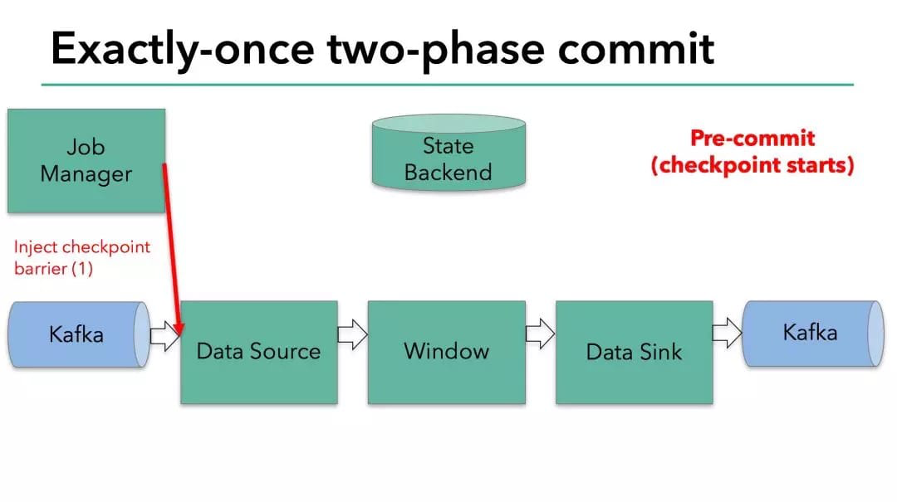
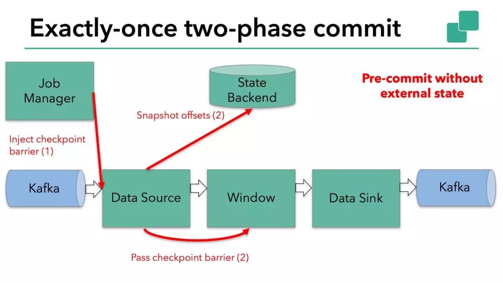
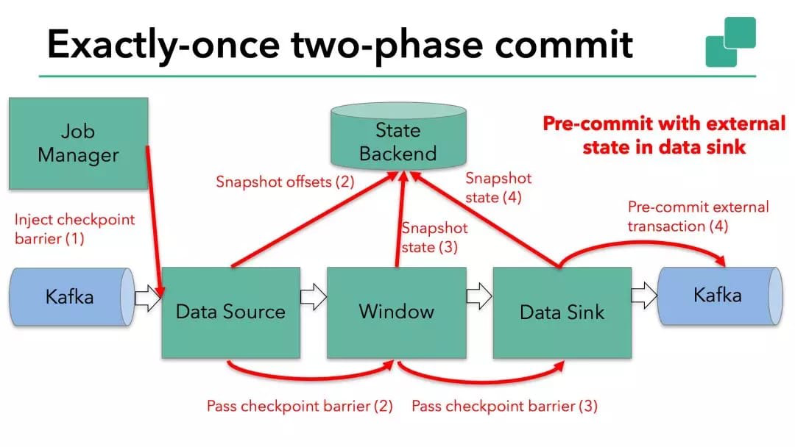
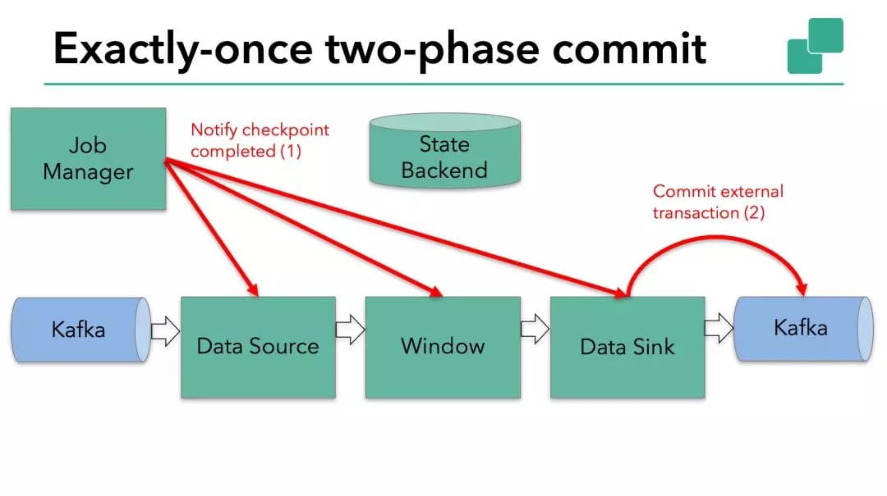

# 【10】Sink的端到端的一致性
> Flink端到端的一直性分为两种情况，一种是系统内部的状态一致性，另一种是发送到系统外部的一致性。

## 10.1 内部的一致性机制
当内部某些节点宕机或者数据丢失，此时会触发恢复机制，从上一次的checkpoint快照中恢复状态结果，并重新部署分布式数据流。

## 10.2 外部的一致性机制
当一次checkpoint栅栏barrier到达sink时往往会触发一次向外部系统发送数据。此处**Flink采用两段提交协议**，手动实现抽象类抽象类TwoPhaseCommitSinkFunction。包括以下方法：
> `beginTransaction`: 初始化一个事务。在有新数据到达并且当前事务为空时调用。
> `preCommit`: 预提交数据，即不再写入当前事务并准好提交当前事务。在 sink 算子进行快照的时候调用。
> `commit`: 正式提交数据，将准备好的事务提交。在作业的 checkpoint 完成时调用。
> `abort`: 放弃事务。在作业 checkpoint 失败的时候调用。

## 例子：flink读写kafka
> 在一个读写 Kafka 的 Flink 程序中实现端到端的 Exactly-Once 语义。Flink 对端到端的 Exactly-Once 语义的支持不仅局限于 Kafka ，您可以将它与任何一个提供了必要的协调机制的源/输出端一起使用。

> - 要使数据输出端提供 Exactly-Once 保证，它必须将所有数据通过一个事务提交给 Kafka。提交捆绑了两个 checkpoint 之间的所有要写入的数据。这可确保在发生故障时能回滚写入的数据。
> - 但是在分布式系统中，通常会有多个并发运行的写入任务的，简单的提交或回滚是不够的，因为所有组件必须在提交或回滚时“一致”才能确保一致的结果。Flink 使用**两阶段提交协议**来解决这个问题。

> - 两阶段提交协议的“预提交”阶段,起始于一次快照的checkpoint开始阶段。即master节点将checkpoint的barrier注入source端，barrier随着数据向下流动直到sink端。barrier每到一个算子，都会出发算子做本地快照。
> - Flink 的 JobManager 会将 checkpoint barrier注入数据流。对于每一个 operator，barrier触发 operator 的状态快照写入到 state backend。

> - Source快照保存了消费 Kafka 的偏移量(offset)，之后将 checkpoint barrier传递给下一个 operator。

> - 本次数据最终写入Kafka，因此数据输出端（ Data Sink ）有外部状态。在这种情况下，在预提交阶段，除了将其状态写入 state backend 之外，数据输出端还必须预先提交其外部事务。

> - 当 checkpoint barrier 在所有 operator 都传递了一遍，并且触发的 checkpoint 回调成功完成时，预提交阶段就结束了。所有触发的状态快照都被视为该 checkpoint 的一部分。checkpoint 是整个应用程序状态的快照，**包括预先提交的外部状态**。如果发生故障，我们可以回滚到上次成功完成快照的时间点。
> - 进入"**提交阶段**"，JobManager 为应用程序中的每个 operator 发出 checkpoint 已完成的回调。数据输出端（Data Sink）拥有外部状态，此时提交外部事务。

## 附：
**同一个 sink 的子任务（subtask）会有多个**，对于下游系统来说它们是处在不同会话和事务中的，并不能保证操作的原子性，因此 exactly-once sink 还需要实现分布式事务来达到所有 subtask 的一致 commit 或 rollback。

由于 sink 事务生命周期是与 checkpoint 一一对应的，或者说 checkpoint 本来就是实现作业状态持久化的分布式事务，**sink 的分布式事务也理所当然可以通过 checkpoint 机制提供的 hook（钩子） 来实现**。Checkpoint 提供给算子的 hook 有 CheckpointedFunction 和 CheckpointListener 两个，前者在算子进行 checkpoint 快照时被调用，后者在 checkpoint 成功后调用。

1. 初始化事务`beginTransaction`：Sink 首先会打开一个临时文件并不断地将收到的数据写入，这时文件处于 in-progress。
2. 预提交阶段`preCommit`：直到这个文件因为大小超过阈值或者一段时间内没有新数据写入，这时文件关闭并变为 pending 状态，将此临时文件发送到外部系统，并收到响应callback状态。若callback失败，则进行出错处理。
3. 提交阶段`commit`：由于 Flink checkpoint 是异步的，可能有多个并发的 checkpoint，Sink 会记录 pending 文件对应的 checkpoint epoch，当某个 epoch 的 checkpoint 完成后，Sink 会收到外部响应callback 并将对应的文件改为 committed 状态。

Commit 出现错误会导致作业自动重启，重启后 Bucketing File Sink 本身已被恢复为上次 checkpoint 时的状态，不过仍需要将文件系统的状态也恢复以保证一致性。从 checkpoint 恢复后对应的事务会再次重试 commit，它会将记录的 pending 文件改为 committed 状态，记录的 in-progress 文件 truncate 到 checkpoint 记录下来的 offset，而其余未被记录的 pending 文件和 in-progress 文件都将被删除。