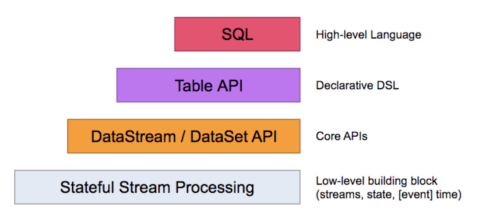

# 【1】Flink简介
## 1.1 简介
> Flink通过实现Google DataFlow流式计算模型实现了**高吞吐、低延迟、高性能**的实时流式计算框架。
> 除了以上优点，Flink还提供:
> - **事件时间Event time**：保证事件即使乱序到达也能通过event time保证计算结果正确性。
> - **有状态计算**：在流失计算中将算子的中间结果保存在内存或文件系统或RockDB中，等下一个事件进入算子可以直接利用上一次的计算结果（状态）。
> - **高度灵活的窗口操作**：可以通过窗口对流式数据进行一定范围的聚合计算。Flink窗口类型包括Time、Count、Seesion和Data-driven等类型，用户可以定义不同的窗口触发机制来满足不同的需求。
> - **轻量级分布式快照技术实现checkpoint容错机制**：每隔一段时间就将一段时间内的数据计算状态进行持久化存储到HDFS或者JobManager中。某次计算出错时，就将上一次的计算状态加载进来重新计算。
> - **基于JVM实现独立的内存管理**：Flink将内存全部以二进制数组的方式占用，形成虚拟内存使用空间。再通过序列化/反序列化方法将对象转换成二进制数组存入内存池，完成计算后置空，这样不需要依赖JVM进行垃圾回收。
> - **Sava Points**：使用户以手工的方式触发CheckPoint，并将结果持久化到指定存储路径中，目的是帮助用户在升级和维护集群的过程中保存系统中的状态数据。避免因为停机维护或者升级应用等正常操作终止应用的操作而导致系统无法恢复到原有的计算状态。从而无法实现端到端的Exactly-Once。

## 1.2 有界数据集和无界数据集
> 根据现实数据产生方式和数据产生是否含有边界（具有起始点和终止点），将数据分为有界数据集和无界数据集。
> 1. **有界数据集**：具有时间边界，在处理过程中数据一定会在某个时间范围内起始和结束。对有界数据集的数据处理方式被成为批处理（Batch Processing）。
> 2. **无界数据集**：数据从开始生成就一直源源不断地产生新的数据，因此数据是没有边界的，例如服务器日志，消息队列消息等。对无边界数据集的处理称为流式数据处理，简称流处理（Streaming Process）。
> **相互转换**：有界和无界是相对时间的范围而定的，两者可以相互转换，可以认为一段时间内的无界数据集就是有界数据集，而同时将有界数据集逐条发送到流式系统，就可以当成无界数据集处理。

## 1.3 编程模型和接口

> Flink将数据处理接口以上而下抽象分成四层：
> 1. **SQL API**：统一的SQL语句完成对批处理和流处理的处理。
> 2. **Table API**：载DataStream和DataSet在原有的基础之上增加Schema信息，将数据类型统一成表结构，再通过Table API提供的接口处理对应的数据集。
> 3. **DataStream/DataSet API**：面向有开发经验的用户，使用DataStream进行流处理，DataSet进行批处理。包括map，filter，window等算子方法。
> 4. Stateful Stream Processing API：是最底层的接口，可通过次接口操作状态、时间等底层数据。

## 1.4 程序结构
> Flink程序结构一共分为5步：
> 1. 设定FLink执行环境；
> 2. 创建和加载数据集；
> 3. 对数据集指定转换逻辑；
> 4. 指定计算结果的输出位置；
> 5. 调用excute方法触发程序执行。