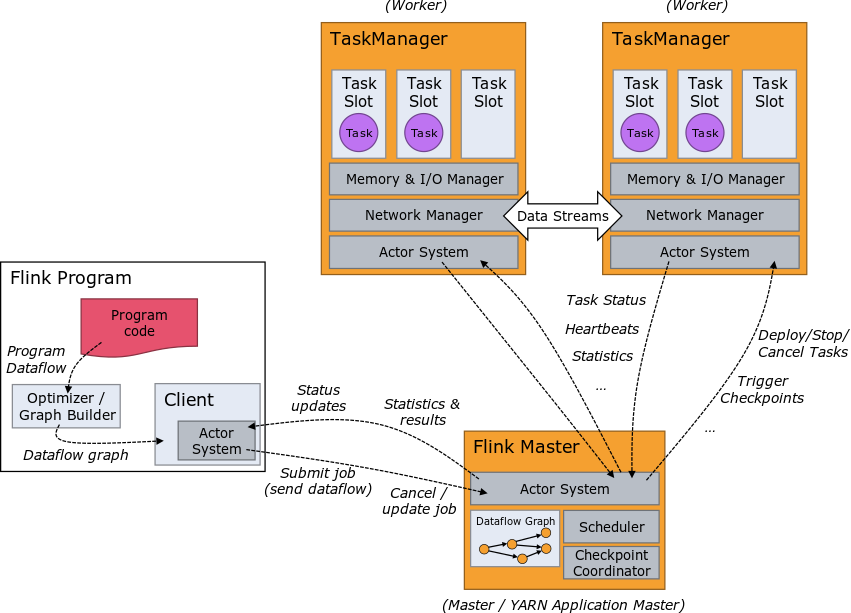
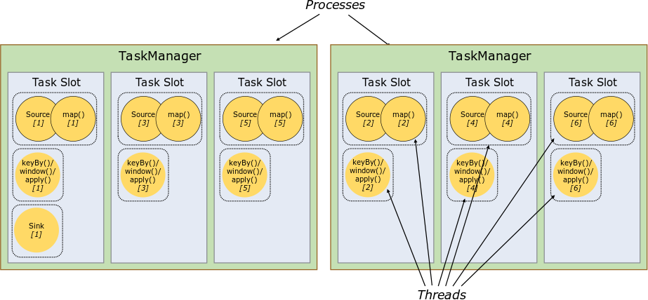
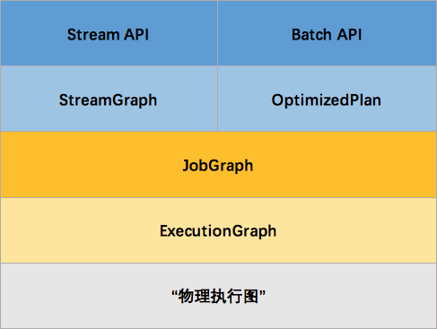

# 【2】Flink架构和Graph拓扑
## 2.1 Flink架构

> Flink整个系统主要包括两个组件：**JobManager**和**TaskManager**。遵循Master-Slave结构设计原则。

### 2.1.1 Client客户端
> 客户端负责将任务提交到集群，与JobManager构建Akka连接，然后将任务提交到JobManager。可以通过CLI方式、Flink WebUI、RPC端口三种方式提交。

### 2.1.2 JobManager
> JobManager相当于整个集群的Master结点，且整个集群中有且只有一个活跃的JobManager。
> 负责将JobGraph转换为ExecutionGraph，任务调度。checkpoint等操作。

**JobManager单点故障:**
> 任何时候都有唯一一个Master JobManager，和多个Standby JobManagers。在JobManager挂掉的情况下，就会有一个Standby JobManagers接管成为Master。
> Standby JobManagers和Master JobManager保持内容同步。

### 2.1.3 TaskManager
> 管理多个slot资源，负责具体的任务执行和对应任务在每个节点上的资源申请与管理。
> 

## 2.2 Graph

> **Flink Stream计算中的执行图**可以分成四层：StreamGraph -> JobGraph -> ExecutionGraph -> 物理执行图。
> 
> - **StreamGraph**：是根据用户在Client客户端通过Stream API编写的代码生成的最初的图。用来表示程序的拓扑结构。
> - **JobGraph**：StreamGraph经过优化后生成了 JobGraph，提交给 JobManager 的数据结构。主要的优化为，将多个符合条件的节点 chain 在一起作为一个节点，这样可以减少数据在节点之间流动所需要的序列化/反序列化/传输消耗。
> - **ExecutionGraph**：JobManager 根据 JobGraph 生成ExecutionGraph。ExecutionGraph是JobGraph的并行化版本，是调度层最核心的数据结构。
> - **物理执行图**：JobManager 根据 ExecutionGraph 对 Job 进行调度后，在各个TaskManager 上部署 Task 后形成的“图”，并不是一个具体的数据结构。

**完整的Flink执行图如下：**

- 首先，`Batch`和`Stream`分开处理，两者的图结构和优化方法有很大的区别，比如`Batch`有很多执行前的预分析用来优化图的执行。
- `JobGraph`的责任就是统一`Batch`和`Stream`的图，用来描述清楚一个拓扑图的结构，并且做了`chaining`的优化。
- `ExecutionGraph`的责任是方便调度和各个tasks状态的监控和跟踪，所以 `ExecutionGraph`是并行化的`JobGraph`。
- “物理执行图”就是最终分布式在各个机器上运行着的tasks了。

