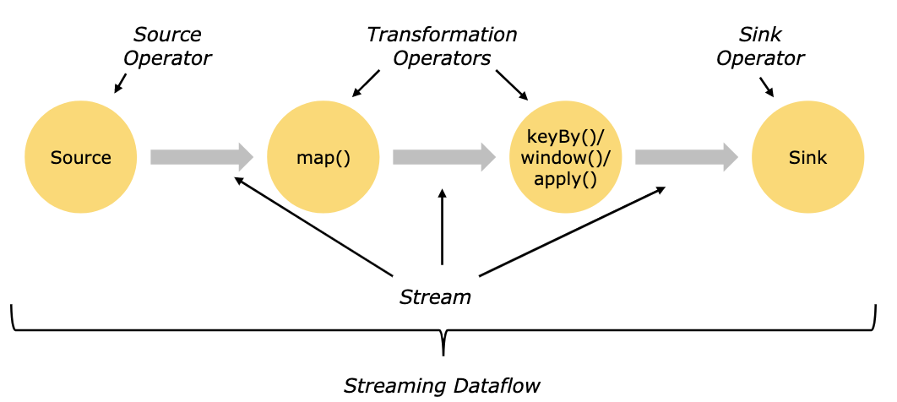
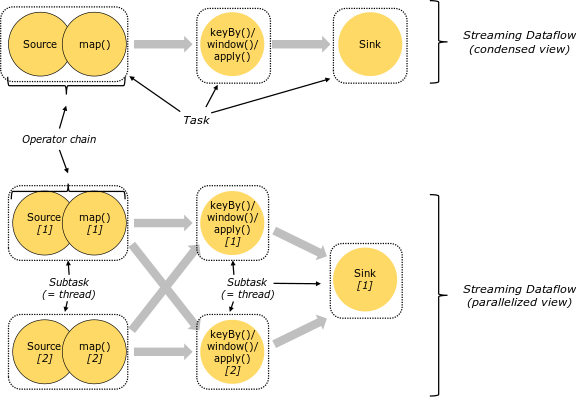

# 【3】DataStream编程模型
> DataStream主要包括三个模块：DataSource模块、Transformation模块和DataSink模块。
> 

## 3.1 DataSource模块
> 主要定义了数据接入功能。将各种外部数据接入Flink系统，并将接入数据转换成对应的DataStream数据集。

### 3.1.1 内置数据源
1. 文件数据源：`readTextFile()`
2. Socket数据源：`socketTextStream()`
3. 集合数据源

### 3.1.2 外部数据源
1. Flink内置数据源连接器：Kafka，RocketMQ。。。
2. 自定义数据源连接器

## 3.2 Transformation模块
> 定义多个的OPerator组成一个DataFlow拓扑。可分为Single-DataStream操作，Multi-DataStream操作。
> SingleDataStream：将一个DataStream形成新的DataStream。包括Map，FlatMap，filter，KeyBy，Reduce，Aggregations等算子，
> Mutil-DataStream：将两个或多个输入数据集合并成一个数据集，包括Union，Connect，CoMap，CoFlatMap,Split等算子。

## 3.3 DataSink模块
> Flink将结果数据输出到外部存储介质或者下游消息中间件的过程为DataSink操作。Flink内部定义了一些第三方外部系统连接器，包括Kafka，ElasticSearch，HDFS等。

## 3.4 并行的DataStream

