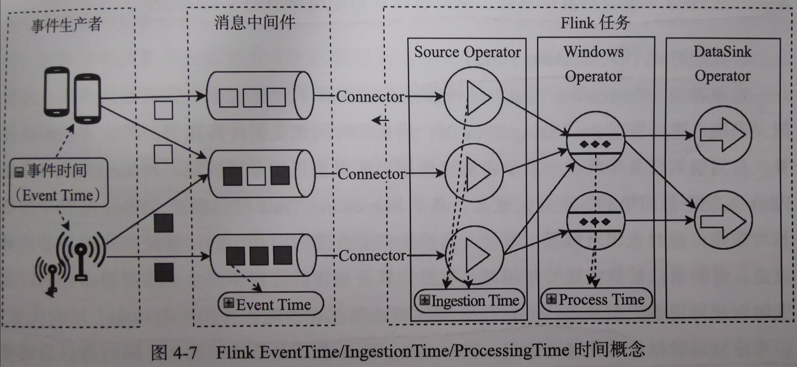

# 【4】Flink的时间概念与应用
## 4.1 时间类型
> Flink将时间分为三种类型。
> - 事件生成时间(Event Time)：数据从上游产生的时间；
> - 事件接入时间(Ingestion Time)：数据接入Flink系统的时间；
> - 事件处理时间(Processing Time)：数据在算子中执行，算子实例所在系统的时间。
> **FLink中的事件概念：事件=数据+操作。**



> 1. **事件时间 Event Time**
> 事件时间常在事件进入系统之前就嵌入到事件中了，FLink能够借助于事件产生时的时间信息来还原事件的先后关系。

> 2. **接入时间 Ingestion Time**
> - 在Source Operator 所在主机的系统时钟，每个记录都将 Source 的当前时间作为时间戳记，并且基于时间的操作（如时间窗口）引用该时间戳记。
> - 与Event Time相比不能处理乱序事件，所以也不用生成对应的Watermarks。

> 3. **处理时间 Processing Time**
> - 处理时间(Processing Time)是指正在执行相应操作的机器的系统时间。基于Processing Time 时间概念，Flink的程序性能相对比较高，延时也相对比较低。
> - 处理时间是不需要流和机器之间的协调。但每台机器的时间如果不同步，也可能导致数据处理过程中数据乱序的问题，从而影响计算结果。
> - 适用于时间计算精度要求不是特别高的计算场景，例如：延时非常高的日志数据等。

## 4.2 时间的应用-Watermark水印（水位线）
> Flink系统中，由于各种元素影响会导致**数据乱序到达或者延迟到达等问题**。这里需要引入**Watermark（水位线）机制**，确保要计算的window中所有元素已到达。
> **Watermark在Source Operator中生成！！逐渐更新到后续transformation算子中去。**

### 4.2.1 Watermark原理
> `Watermark = 最新的事件时间(Event time) - 固定时间间隔。`
> - 该时间间隔为用户外部配置的支持最大延迟到达时间，也就是说不会有事件超过该间隔到达。否则就认为是迟到事件或异常事件。
> - 当Operator水位线时间戳大于窗口结束时间EndTime，且窗口中含有事件数据，就立即触发窗口进行计算，此步骤定义于窗口触发机制中。

### 4.2.2 watermark的应用
> 1. 顺序事件中的wartermarks
    > 如果数据元素的时间事件是有序的，wartermark并不会起到特别的大的作用，反而因为设定了超期时间而导致延迟输出计算结果。
> 2. 乱序事件中的wartermarks
    > **wartermark可以很好的解决乱序到达的事件**，如下，Event11 和 Event17 进入到系统中，Flink会根据设定的延时值分别计算出 Watermark W(11) 和 Watermark W(17) ，这两个Watermark到达一个Operator后便立即调整算子基于事件时间的虚拟时间与当前的 Watermark 相匹配，然后再触发相应的计算以及输出操作。
    > 
> 3. 并行数据流中的watermarks
    > - **Watermark在Source Operator中生成**，并且在每个Source Operator的子Task中都会独立生成Watermark。在Source Operator的子任务中生成后就会更新该Task的Watermark,且会逐步更新下游算子中的Watermark水位线。
    > - 当遇到Multi-datastream算子操作，即**多个watermark更新一个算子Task**的当前事件时间时，Flink会选择最小的水位线来更新。
    > 


### 4.2.3 watermark指定Timestamps与生成Watermarks
> 首先需要在StreamExecationEvironment中指定`TimeCharacteristic`。

```
env.setStreamTimeCharacteristic(TimeChracteristic,EventTime)
```
> 然后指定使用数据中的哪个字段作为对应的时间戳时间。目前支持两种方式指定时间戳和生成watermark：
    > 1. 在`DataStream Source`算子接口的`Source Function`中定义。
    > 2. 若用户使用了FLink已经定义的**外部数据源连接器**，则不能使用Source Function接口来生成流式数据。此时需要借助`Timestamp Assigner`来管理数据流中的Timestamp元素和Watermark。
    