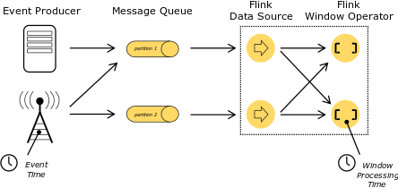
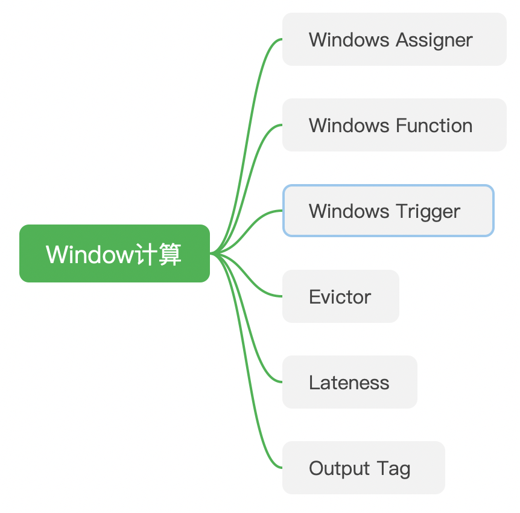
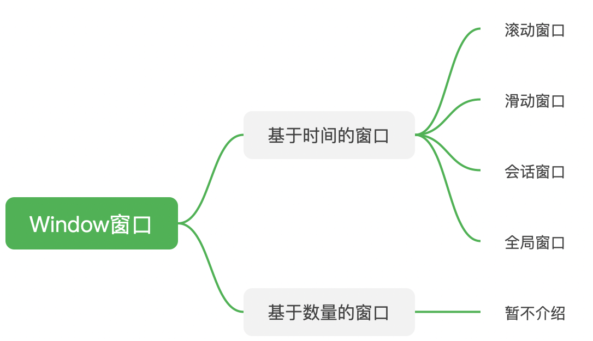
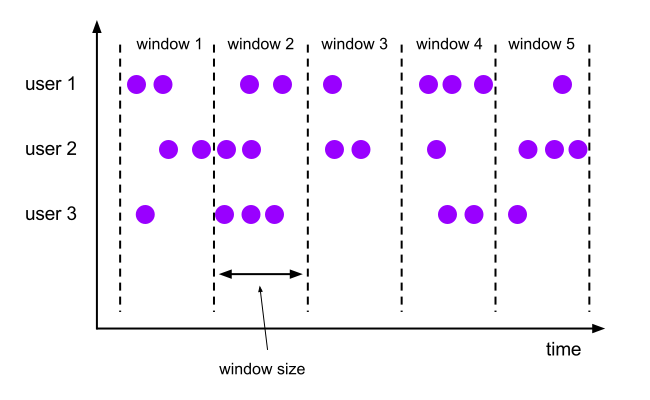
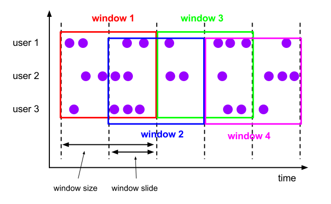
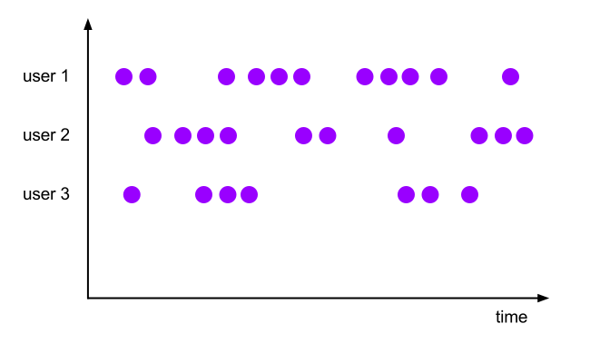

# 【5】Window计算

## 5.1 Window窗口算子的组成

- **Windows Assigner**：指定窗口类型，定义如何将数据流分配到一个或多个窗口。
- **Windows Function**：定义窗口处理逻辑。
- **Windows Trigger**：指定窗口触发机制。
- **Evictor**：用于数据剔除。
- **Lateness**：标记是否处理延迟数据。
- **Output Tag**：标记输出标签。

## 5.2 Window的分类

> 这里只介绍基于时间的窗口，即基于起始时间戳和终止时间戳来决定区间大小。

1. **滚动窗口**：按固定的时间或大小进行切分，且窗口和窗口之间的元素互不重叠。

2. **滑动窗口**：在滚动窗口的基础之上增加了窗口的滑动时间，且允许窗口数据发生重叠。

3. 会话窗口：在规定的时间内如果没有数据活跃接入，则认为窗口结束，然后触发窗口计算。但是当数据一直不间断接入会一直不触发窗口。适合非连续型或周期性产生数据的场景。

4. 全局窗口：将所有相同的key的数据分配到单个窗口中进行计算，窗口需要借助Trigger来触发计算。



## 5.3 Windows Function的分类

- 增量聚合函数：基于中间状态的计算结果，不需要缓存原始数据值，占用存储空间较少，计算性能较高。
- 全量窗口函数：对所有属于该窗口的接入数据进行缓存，然后等到窗口触发时，对所有原始数据进行汇总计算。

## 5.4 窗口触发器Trigger

- EventTimeTrigger：通过对比watermark和窗口EndTime确定是否触发窗口。
- ProcessTimeTrigger：通过对比ProcessTime和窗口EndTime确定是否触发窗口。
- CountTrigger：根据接入数据量是否超过设定的阈值确定是否触发窗口计算。
- DeltaTrigger：根据接入数据计算出来的Delta指标是否超过指定的Thredhold，判断是否触发窗口计算。

## 5.5 延迟数据处理
> 即使通过watermark也无法保证所有数据全部进入窗口再处理。对于延迟到达的数据，FLink默认会做丢弃处理。
> 但是，通过`Allowed Lateness机制`来对迟到的数据来进行额外的处理。
> 通过DataStream API提供的`allowLateness方法`指定一个**延迟时间T，会将窗口的EndTime+该延迟时间T，作为窗口最后被释放的时间**。即如果EventTime未超过该时间，且watermark超过EndTime则直接触发窗口计算。若超过该窗口的最后释放时间，则只能做丢弃处理。
> 这些延迟数据计算出来的结果如果不想混入正常得计算流程，只想对最终写入结果起作用的话，可通过`Output Tag`来**标记迟到的数据结算结果**。

## 5.5 数据剔除器
是一个可选组件，主要作用是对进入WindowFunction前后的数据进行剔除处理。


## 5.6 连续窗口计算
包括独立窗口计算，连续窗口计算两种方式。
独立窗口计算（分叉）：对同一个DataStream进行不同的窗口处理，窗口之间相互独立，并将结果输出为不同的DataStream。
```
windowStream1 = inputStream.map()...
windowStream2 = inputStream.map()...
```
连续窗口计算（串行）：前一个窗口计算的DataStream结果作为下一个窗口计算的输入。
```
windowStream1 = inputStream.map()...
windowStream2 = windowStream1.map()...
```

## 5.7 windows多流合并
> Flink支持窗口上的多流合并，即在一个窗口中按照相同条件对两个输入数据流进行关联操作。
> 多流合并需要保证输入的两个或多个Stream要构建在相同的Window上，并使用相同类型的Key作为关联条件。