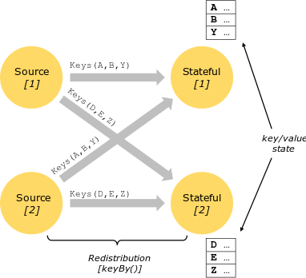

# 【6】Flink的状态管理
## 6.1 Flink有状态计算
> 有状态计算：指在程序计算过程中，在FLink程序内部存储计算产生的中间结果，并提供给后续Function或算子计算结果使用。这些状态可以保存在FLink堆内存或堆外内存，也可以借助第三方的存储介质，例如Flink中已经实现的RockDB。

## 6.2 Flink状态类型及应用
根据数据集是否根据Key进行分区，将状态分为Keyed State 和 Operator State(Non-Keyed State)两种类型。

### 6.2.1 Keyed State

Keyed State是Operator State的特例，每个Key State仅对应一个Operator和Key的组合。保留这些key对应的数据在经过响应Operator处理之后(状态)生成的结果。

### 6.2.2 Operator State
Operator State保留每个算子实例上的数据状态。每个算子实例持有全部数据集的一部分。Operator State是和并行的算子实例绑定的。每当并行度变化时，算子实例上的分得的数据集也有变化。

**算子实例：**
在Keyed分区的数据集中，每个算子实例可能会运行多个Key groups的数据集。

### 6.2.3 状态数据的管理形式
1. **托管状态（Managed State）**
由Flink Runtime控制和管理状态数据，并将状态数据转换成为内存Hashtable或RockDB的对象存储，最后将这些状态数据通过内部接口持久化到Checkpoints，任务异常时可以通过Checkpoint中的状态数据恢复任务。
2. **原生状态（Raw State）**
由用户自定义管理算子的状态数据，当触发checkpoint时，Flink只将数据转换成bytes数据存储在Checkpoints中，当从checkpoints中恢复任务时，用户在自己反序列化出算子的状态的数据结构。