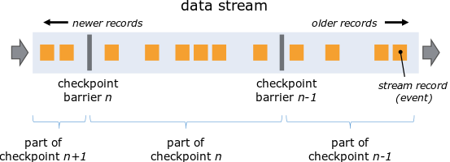
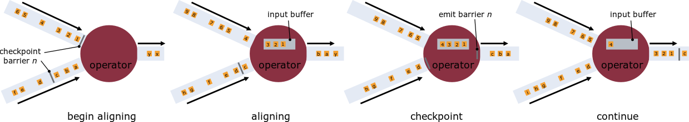
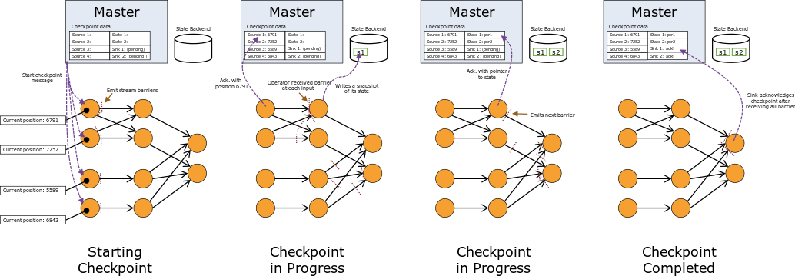
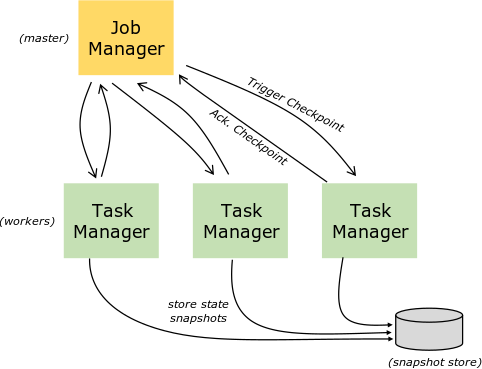

# 【7】Checkpoints容错机制
Flink中基于异步轻量级分布式快照技术提供了Checkpoints容错机制，**分布式快照将同一时间点的Task/Operator的状态数据全局统一快照处理**，包括前面提到的Keyed State和Operator State。

## 7.1 Checkpoint和栅栏Barrier

Flink会在输入的数据集上间隔性地生成checkpoint barrier，**通过栅栏（barrier）就可以将间隔时间段内的数据划分到相应的checkpoint中**。
> checkpoint的数据一般保存在一个可配置的环境中，通常是JobManager节点或HDFS上。

## 7.2 并行Operator的checkpoint实现
当一个Operator接受多个DataStream数据时，需要进行栅栏（barrier）对齐。

> 如上图，一旦Operator从传入流接收到快照栅栏n，它就不能处理来自该流的任何其他记录，直到它也从其他输入流接收到屏障n。

## 7.3 snapshot形成过程

> - Operator在从其输入流接收到所有快照栅栏barrier并在将栅栏barrier发送到其输出流之前对其状态进行快照snapshot。**所有的Operator的快照组成了一个checkpoint。**
> - **每个Operator的snapshot为Checkpoints的一部分。State Backend管理多个Operator的快照snapshot。**

## 7.4 Checkpoint恢复流程
> - 发生故障时，Flink从State Bankend状态管理器中拿出最新的第k次checkpoint，然后重新部署整个分布式数据流，并向每个Operator提供第k次状态数据的快照snapshot作为输入。
> - 如果状态是增量快照，则操作员将从最新完整快照的状态开始，然后对该状态应用一系列增量快照更新。

## 7.4 状态管理器
状态管理器可以自定义保存状态的数据结构，使用键值对或者其他方式。

Flink中一共实现了三种类型的状态管理器：基于内存的状态管理器、基于文件系统的状态管理器和基于RockDB的状态管理器。
1. **基于内存MemoryStateBankend**
> 状态数据全部存储在内存中，具有非常快速和高效的特点，但是内存容量是有限制的，容易出现内存溢出等问题。
2. **基于文件FsStateBankend**
> 借助文件系统能最大程度保证状态数据的安全性，不会出现因为外部故障导致任务无法恢复。但是，由于系统IO和数据的传输，导致不是很高效。
3. **基于RockDB RocksDBStateBankend**
> 采用异步方式进行状态数据的snapshot，先将状态数据写入RockDB，再异步地写入到文件系统中。这样，RockDB仅会存储热数据，长时间未用的数据写入磁盘文件系统中。这样比纯粹的文件系统要高效，比基于内存的管理器要安全。
