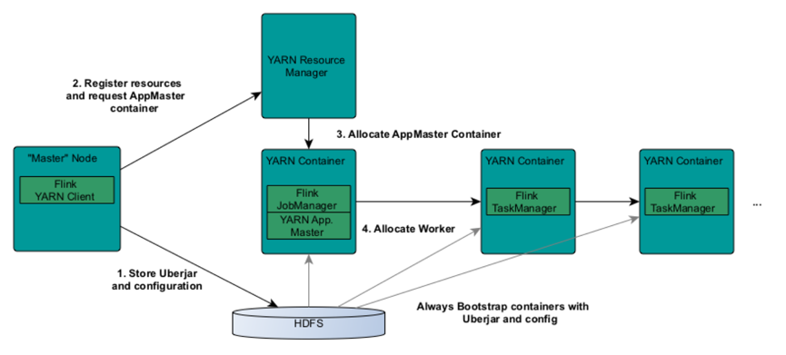
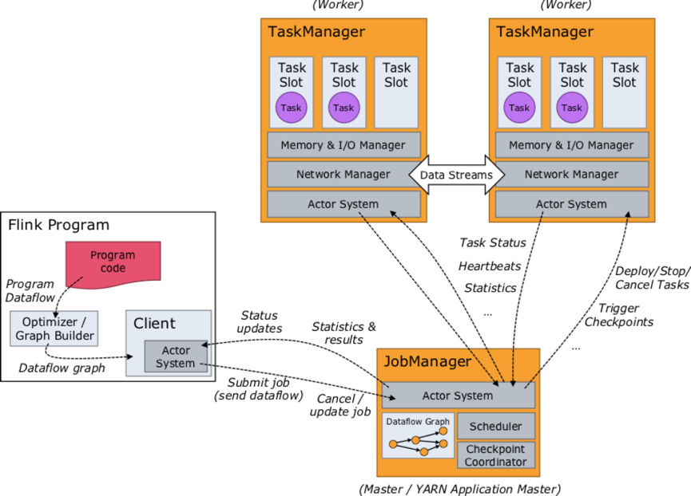
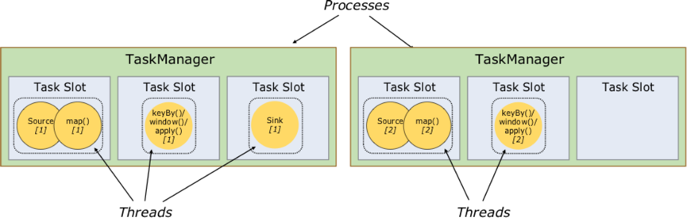
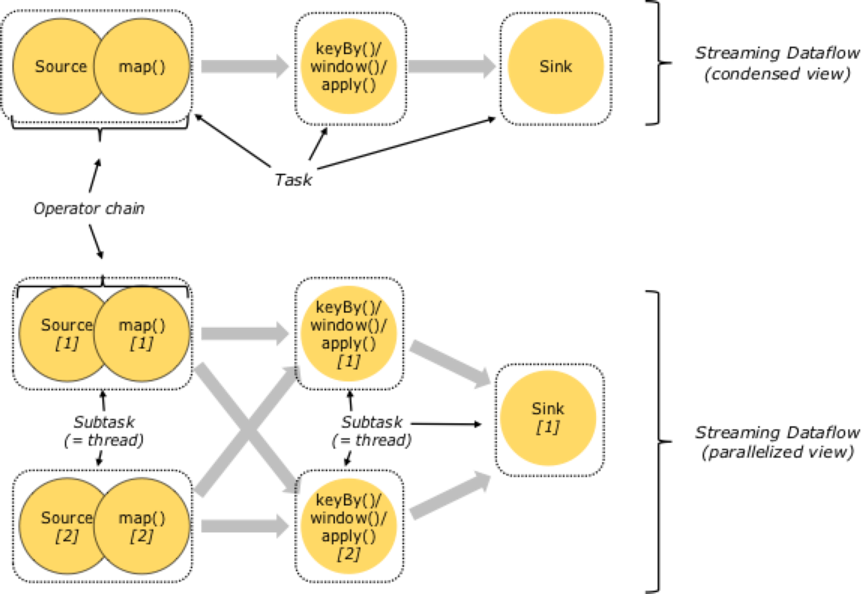
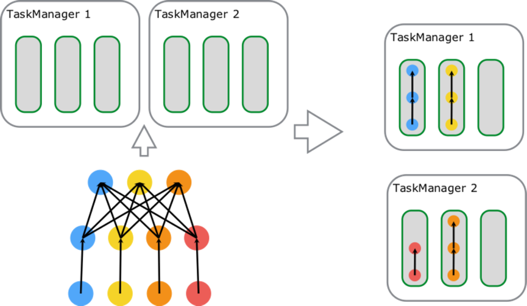
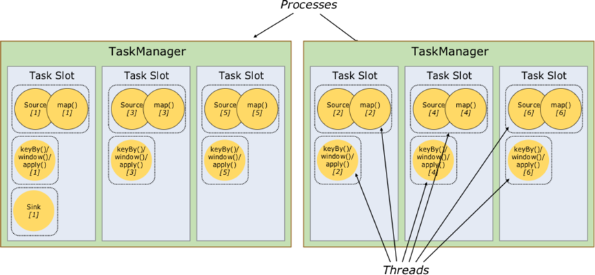

# 【8】Operator Chain和Slot Sharing

> **每个JM（JobManager），TM（TaskManager）都是运行在一个独立的 JVM 进程中**。
> 每个 TM 最少持有 1 个 Slot，Slot是 Flink 执行 Job 时的最小资源分配单位，**在 Slot 中运行着具体的 Task 任务。每个Slot执行一个task线程任务**。

## 8.1 TM中的内存和CPU资源的分配
> 每个TM都拥有一定数量的CPU和内存资源。
> - `taskmanager.heap.size`来制定TM堆内存的大小，在Yarn环境下一般会减掉一部分内存用于Container的容错。
> - `taskmanager.numberOfTaskSlots`可用来指定每个TM拥有的slot数量。一般建议配置的Slot数量和CPU数量相等或成比例。

> 借助 Yarn 等调度系统，用 Flink On Yarn 的模式来为 Yarn Container 分配指定数量的 CPU 资源，以达到较严格的 CPU 隔离。
> 1. **Slot内存隔离**：
> **同一个 TM 内的 Slots 只有 Memory 隔离，CPU是共享的**。如果一个 TM 有 N 个 Slot，则每个 Slot 分配到的 Memory 大小为整个 TM Memory 的 1/N。
> 2. **Slot数量与Operator并行度**：
> **一个 Job 所需的 Slot 数量大于等于 Operator 配置的最大 Parallelism 数**，在保持所有 Operator 的 slotSharingGroup 一致的前提下 Job 所需的 Slot 数量与 Job 中 Operator 配置的最大 Parallelism 相等。
> 3. **Task分配**：
> 一个Task（算子）可以分成多个SubTask（实现Runable多线程）。在不考虑 **Slot Sharing**（下文详述）的情况下，一个 Slot 内运行着一个 **SubTask**（Task 实现 Runable，SubTask 是一个执行 Task 的具体实例）

## 8.2 Yarn Container

> 每个 JM/TM 实例都分属于不同的 Yarn Container，且每个 Container 内只会有一个 JM 或 TM 实例；
> 每个 Container 都是一个独立的进程，一台物理机可以有多个 Container 存在（多个进程），每个 Container 都持有一定数量的 CPU 和 Memory 资源，而且是资源隔离的，进程间不共享，这就可以保证同一台机器上的多个 TM 之间是资源隔离的（Standalone 模式下，同一台机器下若有多个 TM，是做不到 TM 之间的 CPU 资源隔离的）。

## 8.3 Slot共享资源

> 图中有两个 TM，各自有 3 个 Slot，2 个 Slot 内有 Task 在执行，1 个 Slot 空闲。若这两个 TM 在不同 Container 或容器上，则其占用的资源是互相隔离的。在 TM 内多个 Slot 间是各自拥有 1/3 TM 的 Memory，共享 TM 的 CPU、网络（Tcp：ZK、 Akka、Netty 服务等）、心跳信息、Flink 结构化的数据集等。

> 如上图，Slot 内运行着具体的 Task，它是在线程中执行的 Runable 对象（每个虚线框代表一个线程），每个 Task 都是由一组 Operators Chaining 在一起的工作集合。

## 8.4 Operator Chain
> **Operator Chain**：是指将 Job 中的 Operators 按照一定策略（例如：single output operator可以 chain 在一起）链接起来并放置在一个 Task 线程中执行。
> Operator Chain 将多个 Operator 链接到一起执行，减少了数据传递 / 线程切换等环节，降低系统开销的同时增加了资源利用率和 Job 性能。

**注【一个需要注意的地方】**：Chained 的 Operators 之间的数据传递默认需要经过数据的拷贝（例如：kryo.copy(…)），将上游 Operator 的输出序列化出一个新对象并传递给下游 Operator，可以通过 ExecutionConfig.enableObjectReuse() 开启对象重用，这样就关闭了这层 copy 操作，可以减少对象序列化开销和 GC 压力等

> **上图的上半部分**： 是StreamGraph 视角，有 Task 类别无并行度，如图：Job Runtime 时有三种类型的 Task，分别是 Source->Map、keyBy/window/apply、Sink，其中 Source->Map 是 Source() 和 Map()chaining 在一起的 Task；
> **上图的下半部分**：是一个 Job Runtime 期的实际状态，Job 最大的并行度为 2，有 5 个 SubTask（即 5 个执行线程）。若没有 Operator Chain，则 Source() 和 Map() 分属不同的 Thread，Task 线程数会增加到 7，线程切换和数据传递开销等较之前有所增加，处理延迟和性能会较之前差。
> **补充**：在 slotSharingGroup 用默认或相同组名时，当前 Job 运行需 2 个 Slot（与 Job 最大 Parallelism 相等）。

## 8.5 Slot Sharing
> **Slot Sharing** 是指，来自**同一个 Job 且拥有相同 slotSharingGroup（默认：default）名称的不同 Task 的 SubTask 之间可以共享一个 Slot**，这使得一个 Slot 有机会持有 Job 的一整条 Pipeline，这也是上文提到的在默认 slotSharing 的条件下 Job 启动所需的 Slot 数和 Job 中 Operator 的最大 parallelism 相等的原因。

> **Slot Sharing的应用**：在Slot数量足够的情况下，增加Operator 可设置的最大的并行度，让类似 window 这种消耗资源的 Task 以最大的并行度分布在不同 TM 上，同时像 map、filter 这种较简单的操作也不会独占 Slot 资源，降低资源浪费的可能性。

> 上图的左下角是一个 soure-map-reduce 模型的 Job，source 和 map 是 **4 parallelism**，reduce 是 **3 parallelism**，总计 11 个 SubTask；这个 Job 最大 Parallelism 是 4，所以将这个 Job 发布到左侧上面的两个 TM 上时得到图右侧的运行图，一共占用四个 Slot，有三个 Slot 拥有完整的 source-map-reduce 模型的 Pipeline，如右侧图所示；注：map 的结果会 shuffle 到 reduce 端，右侧图的箭头只是说 Slot 内数据 Pipline，没画出 Job 的数据 shuffle 过程。

**更详细的图如下**：

> 图中包含 **source-map**[6 parallelism]、**keyBy/window/apply**[6 parallelism]、**sink**[1 parallelism] 三种 Task，总计占用了 6 个 Slot；由左向右开始第一个 slot 内部运行着 3 个 SubTask[3 Thread]，持有 Job 的一条完整 pipeline；剩下 5 个 Slot 内分别运行着 2 个 SubTask[2 Thread]，数据最终通过网络传递给 Sink 完成数据处理。

