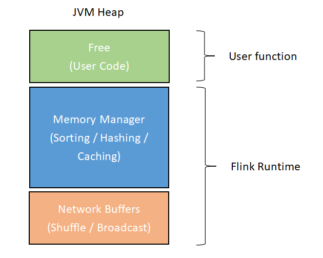
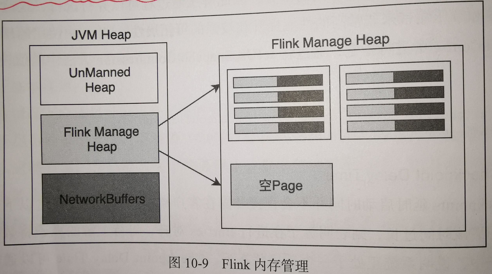

# 【9】Flink的内部优化
https://www.infoq.cn/article/ZmL7TCcEchvANY-9jG1H
## 9.1 Slot Chain和Slot Sharing
1. **Operator Chain**
Operator Chain是将多个Operator链接在一起放置在一个Task中，只针对Operator。例如：
```
someStream.filter(…).map(…).startNewChain().map()： 
```
> **startNewChain**()是指从当前 Operator[map] 开始一个新的 chain，即：两个 map 会 chaining 在一起而 filter 不会（因为 startNewChain 的存在使得第一次 map 与 filter 断开了 chain）。
> Operator Chain 有三种策略 ALWAYS、NEVER、HEAD，在通常情况下 ALWAYS 是效率最高。

2. Slot Sharing
Slot Sharing 是在一个 Slot 中执行多个 SubTask，针对的是 Operator Chain优化之后的 Task。

**【总结：】**
> 这两种优化都充分利用了计算资源，减少了不必要的开销，提升了 Job 的运行性能。此外，Operator Chain 的源码在 streaming 包下，只在流处理任务中有这个机制；

## 9.2 Asynchronous IO异步操作
Flink支持通过异步方式连接外部存储系统，以提升Flink系统与外部数据库交互的性能与吞吐量，但前提是外部数据库本身支持异步客户端。

**控制因素**：
在异步IO中需要考虑对数据库**查询超时**和**并发线程数**控制两个因素。一旦并发线程数耗尽，FLink会直接触发反压机制来抑制上游数据的接入。

## 9.3 Checkpointing优化
**问题1：**
> 配置好Checkpoint的时间间隔，就会周期性的对应用进行Checkpoint操作，但是如果**某一次Checkpoint的时间过长**（对大状态数据进行checkpoint）时，会**导致后面的Checkpoint进行排队**，这样会导致用于任务计算的资源减少，影响应用的性能和稳定。

解决：
> 通过**最小间隔参数**进行checkpoint执行速度进行调整，当前面的checkpoint没有结束，后面的checkpoint操作不会触发。

补充:
> 最小时间间隔优化，只能减轻checkpoint之间的堆积情况，对于大状态数据的checkpoint，应该对checkpoint过程进行优化，例如采用增量checkpoint的方式。


## 9.4 Flink内存优化
> Flink基于JVM运行，当创建对象过多，而GC没有及时回收常常会出现内存溢出的问题。所以，FLink有了一套自己的内存管理机制。

每个TaskManager中的JVM堆内存结构如下：

> - Free（Unmanned）Heap：是留给用户代码以及 TaskManager 的数据结构使用的
> - Manager Heap：用于存储序列化后的数据，是FLink主要管理区域。
> - NetWork Buffers：数据的网络传输缓冲区，主要用于缓存分布式数据处理过程中的输入数据。

**Manager Heap方式**

> 在启动集群的过程中直接将Manager Heap初始化成Memory Pages Pool，**也就是将内存全部以二进制数组的方式占用**，形成虚拟内存使用空间。
> 新创建的对象都是以序列化成二进制数据的方式存储在内存页面池中，当完成计算后数据对象就会将该page置空，而不是通过GC进行回收。
