# 【3】分布式缓存
## 3.1 缓存出现背景
> 互联网分布式系统中，直接使用数据存储服务，这样数据库往往是扛不住的，效率也比较低。通常在mysql等数据库之前添加一个或多个Cache缓存服务器，减少对数据库的直接访问，常见的Cache缓存有Memcached和Redis。

## 3.2 缓存概述
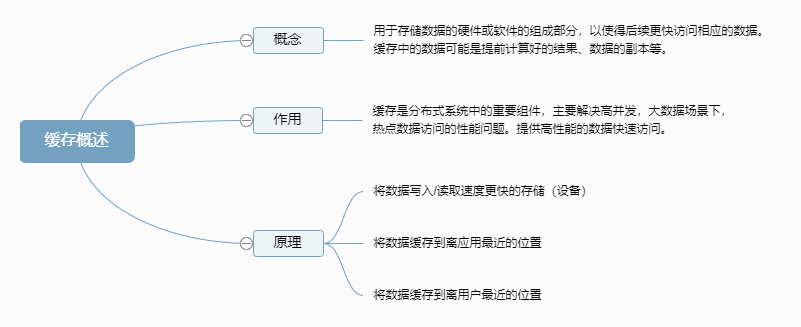

## 3.3 缓存分类
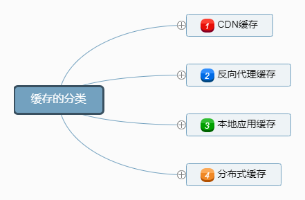

## 3.3.1 CDN缓存
将数据缓存在CDN服务器中，由运营商网络直接管理。
常用来缓存静态资源，例如图片，视频。
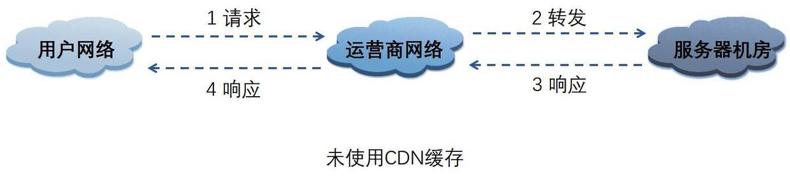
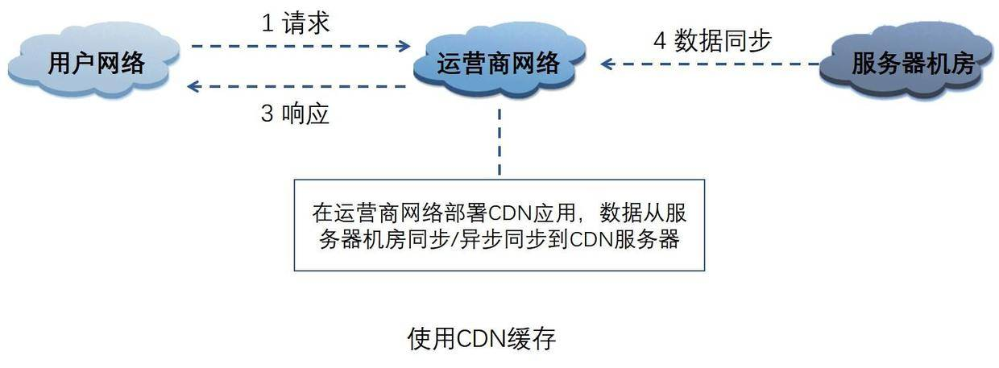
优点：
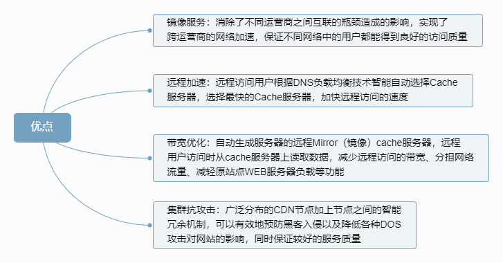

## 3.3.2 反向代理缓存
反向代理缓存**位于应用服务器机房**，处理所有对WEB服务器的请求。 如果用户请求的页面在代理服务器上有缓冲的话，代理服务器直接将缓冲内容发送给用户。如果没有缓冲则先向WEB服务器发出请求，取回数据，本地缓存后再发送给用户。
一般只缓存体积较小静态文件资源，如css、js、图片
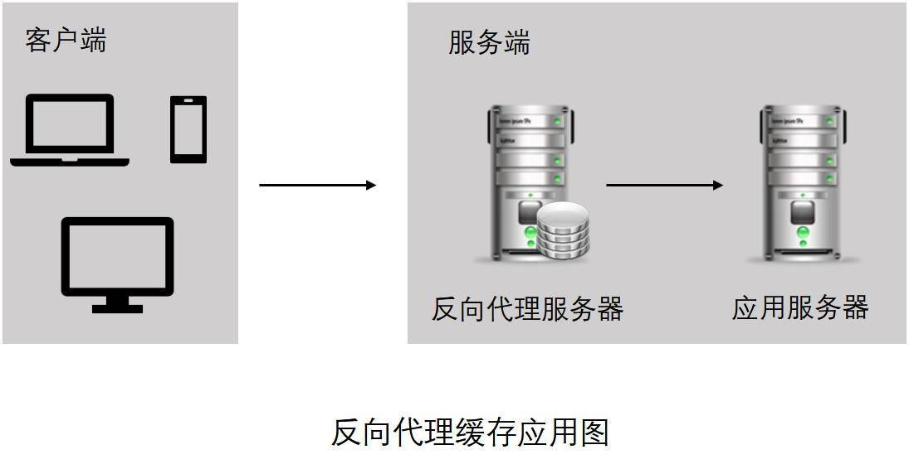
常见的反向代理缓存包括：Nginx，Varnish，Squid

## 3.3.3 本地应用缓存
在应用中的缓存组件，其最大的优点是应用和cache是在同一个进程内部，请求缓存非常快速，没有过多的网络开销等，在单应用不需要集群支持或者集群情况下各节点无需互相通知的场景下使用本地缓存较合适；
同时，**它的缺点也是应为缓存跟应用程序耦合，多个应用程序无法直接的共享缓存**，各应用或集群的各节点都需要维护自己的单独缓存，对内存是一种浪费。
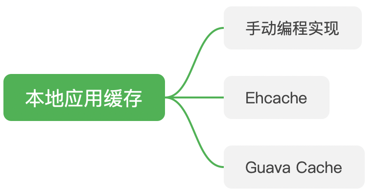

## 3.3.4 分布式缓存
与应用分离的缓存组件或服务，其最大的优点是自身就是一个独立的应用，与本地应用隔离，**多个应用可直接的共享缓存**。
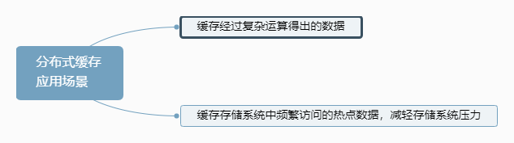
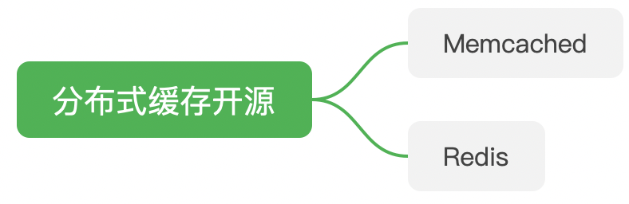
1. **Memcached**
Memcached在内存中维护一个巨大的Hash表，表结构为键值对。当表容量到达上限时，会采用LRU算法进行回收内存。并且Memcached采用懒过期策略，即在数据存入时，设置过期时间TTl，在get时查看该数据是否过期。
Memcached内存管理：
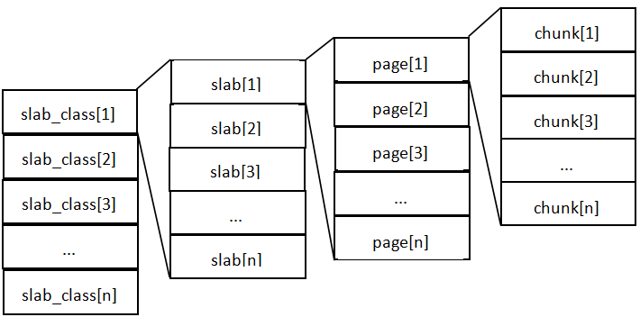
> 1. slab_class里，存放的是一组组chunk大小相同的slab
> 2. 每个slab里面包含若干个page，page的默认大小是1M，如果slab大小100M，就包含100个page
> 3. 每个page里面包含若干个chunk，chunk是数据的实际存放单位，每个slab里面的chunk大小相同

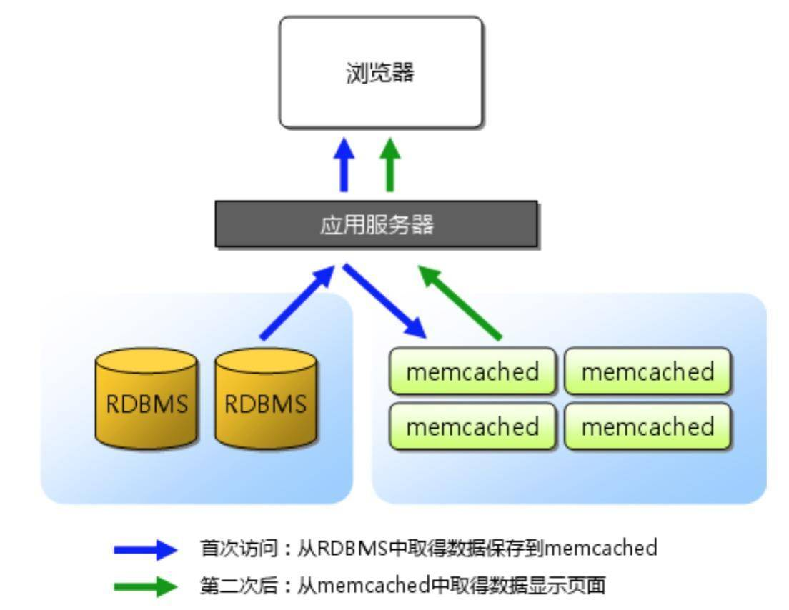
MemCached缓存的数据全部存储在MemCached管理的内存中，所以重启服务器之后缓存数据会清空，**不支持持久化**。

Memcached分布式
当使用多个Memcached进行负载均衡时，每个Memcached只能管理自己的数据，分布式部署需要在客户端进行配置。
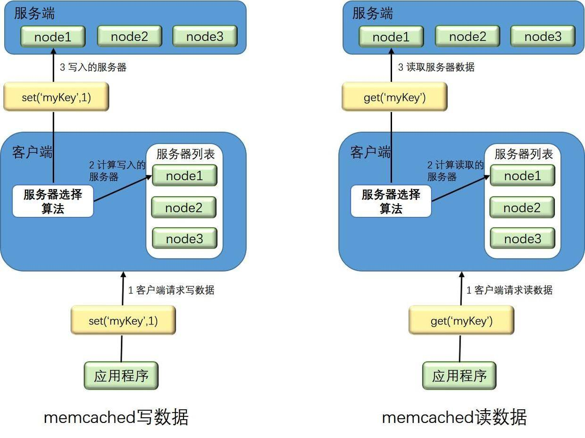
客户端自行采用一些**负载均衡算法**，根据Key实现缓存服务器选择。

2. **Redis**
Redis是一个远程内存数据库（非关系型数据库），存储键值对与5种不同类型的值之间的映射，能够支持事务，可以将存储在内存的键值对数据持久化到硬盘。
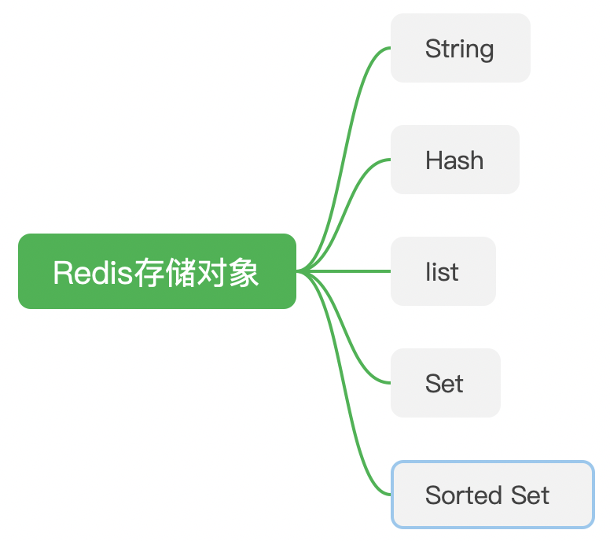
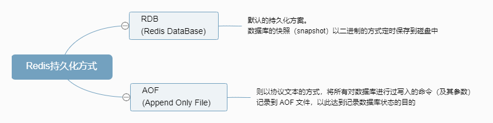

**Memcached和Redis的区别**
|  | Redis | Memcached |
| --- | --- | --- |
| 支持的数据结构 | 字符串、哈希、列表、集合、有序集合 | 纯kev-value |
| 持久化支持 | 支持 | 不支持 |
| 多线程 | 单线程 | 多线程 |
| 过期策略 | 定时清理 | 懒过期 |
| value容量 | 最大512M | 最大1M |
| 存储空间 | 内存+磁盘 | 内存 |
| 高可用支持 | 支持热备 | 不支持 |
| 水平扩展 | 需要客户端实现 | 需要客户端实现 |
| 适用场景 | 复杂数据结构、有持久化、高可用需求、value存储内容较大 | 纯KV，数据量非常大，并发量非常大的业务 |

> 分布式缓存的水平扩展（增减缓存服务器）需要自己在客户端进行开发。采用**负载均衡算法**，来合理的缓存读写的数据。