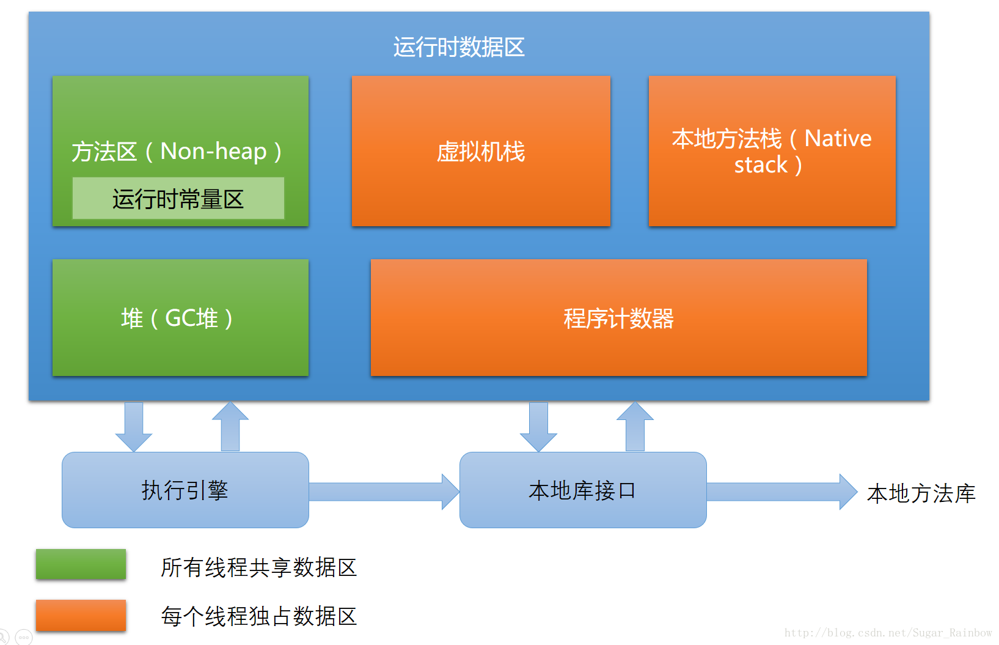

# 【10】JVM堆

## 10.1 JVM结构

1. 线程私有：
- 程序计数器：记录程序下一条指令地址。
- JVM栈：存放了当前线程调用方法的局部变量表、操作数栈、动态链接、方法返回值等信息
- 本地方法栈：为虚拟机使用的Native方法提供服务，就是Java程序调用了非Java代码，算是一种引入其它语言程序的接口
2. 线程共享：
- 堆：存放对象实例（与引用是两个概念），也是垃圾回收器主要管理的地方，故又称GC堆。
- 方法区：存储加载的类信息、常量区、静态变量、JIT（即时编译器）处理后的数据等，类的信息包含类的版本、字段、方法、接口等信息。需要注意是常量池就在方法区中。

## 10.2 栈和堆
- 栈内存：用于存放一些函数的基本类型的变量和对象的引用变量。
- 堆内存：用于存放由new创建的对象和数组。
> 释放：
> 普通类型变量和引用变量在程序运行到其作用域外时就释放，而对象和数组不会。对象和数组的释放只在没有引用变量指向他们的时候，在随后一个不确定的时间由GC垃圾回收机制进行回收。

