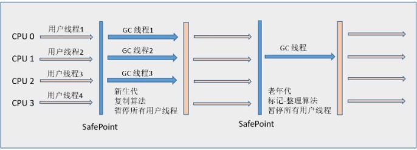

# 【11】Java垃圾回收机制

## 11.1 垃圾收集算法
- 标记-清除法：先按周期清除法标记回收对象，然后统一清楚被标记的对象。产生大量不连续内存碎片。
- 复制法：将内存分成两半，每次使用一半，用完以后将还存活的对象复制到另一块。
- 标记-整理法：按周期标记回收对象，再将存活对象统一整理到一端，直接将边界外内存清空。
- 分代收集法：将堆分为年轻代，老年代和永久代。
    - 年轻代：只有少量对象能存活下来，Eden：survive=8:1，使用复制或标记-清除法。
    - 老年代：包括大内存对象和多次minor GC（15次以上）存活对象，使用标记-整理算法。
    
## 11.2 垃圾收集器

> 上图展示了作用于不同分代的垃圾收集器，如果两个收集器之间存在连线，就说明它们可以搭配使用。收集器所处的区域，则表示它是属于新生代收集器还是老年代收集器。

**收集器总结：**

| 收集器 | 串行/并行/并发 | 年轻代/老年代 | 算法 | 目标 | 适用场景 |
| --- | --- | --- | --- | --- | --- |
| Serial | 串行 | 年轻代 | 复制算法 | 响应速度优先 | 单CPU环境下的Client模式 |
| ParNew | 并行 | 年轻代 | 复制算法 | 响应速度优先 | 多CPU环境时在Server模式下与CMS配合 |
| Parallel Scavenge | 并行 | 年轻代 | 复制算法 | 吞吐量优先 | 在后台运算而不需要 |
| Serial Old | 串行 | 老年代 | 标记-整理算法 | 响应速度优先 | 单CPU环境下的Client模式、CMS的后备预案 |
| ParNew Old | 并行 | 老年代 | 标记-整理算法 | 吞吐量优先 | 在后台运算而不需要太多交互的任务 |
| CMS | 并发 | 老年代 | 标记-清除算法 | 响应速度优先 | 集中在互联网站或B/S系统服务端上的Java应用 |
| G1 | 并发 | Both | 标记-整理+复制算法 | 响应速度优先 | 面向服务端应用，将来替换CMS |

### 10.2.1 Minor GC和Full GC
- Minor GC：发生在年轻代的垃圾收集动作，由于Java对象大多都具备朝生夕灭的特性，所以Minor GC非常频繁，一般回收速度也比较快。
- Full（Main） GC：发生在老年代的GC，出现了Major GC，经常会伴随至少一次的Minor GC（但非绝对的，在Parallel Scavenge收集器的收集策略里就有直接进行Major GC的策略选择过程）。Major GC的速度一般会比Minor GC慢10倍以上。

### 10.2.2 年轻代收集器
1. Serial收集器
> 采用**复制算法的新生代收集器**，更重要地是，这个收集器是**串行的**，在进行垃圾收集时，必须暂停其他所有的用户工作线程，直至Serial收集器收集结束为止（“Stop The World”）。
> **运行原理**：老年代采用Serial Old收集器：
> 
> **优点**：简单而高效，没有线程交互开销，常用于用户的桌面应用内存管理场景中。

2. ParNew收集器
> 是**Serial收集器的多线程版本**，也是一个新生代收集器。除了多线程以外，其余行为规则与Seaial完全相同。
> 运行原理：老年代采用Serial Old收集器：
> 
> 优点：**它默认开启的收集线程数与CPU的数量相同**，在单CPU的环境中比Serial收集器效果较差，存在线程交互的开销。随着cpu数量的增加，效率逐渐提高。另外，**除了Serial收集器外，只有它能和CMS收集器配合工作。**

3. Parallel Scavenge 收集器
> 是一个**并行**的**多线程年轻代收集器**，也使用复制算法。Parallel Scavenge收集器的目标是达到**一个可控制的吞吐量**。
> **优点**：主要适合在后台运算而不需要太多交互的任务，除了可以手动输入吞吐量参数，还可以通过**GC自适应的调节策略**，动态获得一个最佳参数。这也是Parallel Scavenge收集器与ParNew收集器的一个重要区别。
> 但是，Parallel Scavenge收集器无法与CMS收集器配合使用

### 10.2.3 老年代收集器
1. Serial Old收集器
> 采用“**标记-整理**”算法的**单线程老年代收集器**。
> 以前，与Parallel Scavenge收集器搭配使用。后来作为**CMS的后备预案**，在发生并发收集失败时使用。

2. Parallel Old收集器
> 是Parallel Scavenge收集器的老年代版本，使用**多线程**和“**标记-整理**”算法。
> 运行原理：年轻代使用Parallel Scavenge收集器：
> 
> 优点：Parallel Scavenge加Parallel Old收集器，实现注重吞吐量以及CPU资源敏感的场合。

3. CMS（Concurrent Mark Sweep）收集器
> 采用“**标记-清除算法**”，获取**最短回收停顿时间为目标**的收集器。
> 收集原理：
> 1. 初始标记：只是标记一下GC Roots能直接关联到的对象，速度很快，需要“Stop The World”。
> 2. 并发标记：进行GC Roots Tracing的过程，在整个过程中耗时最长。
> 3. 重新标记：修正标记变动的对象，此阶段也需要“Stop The World”。
> 4. 并发清除：并发清除需要回收对象。
> 
> 优点：主要优点是并发收集和低停顿。具有高响应速度。
> 缺点：1. 对CPU资源比较敏感；
> 2. 无法处理**浮动垃圾**：由于CMS并发清理阶段出现新的垃圾之后，CMS无法在本次收集中处理掉它们，只好留待下一次GC时再清理掉。这一部分垃圾就被称为“浮动垃圾”。
> 3. **标记-清除算**法产生的不连续内存碎片。

### 10.2.4 G1收集器
> 采用**标记-整理+复制算法**，能同时管理年轻代和老年代。
> **整合堆内存**：将**整个Java堆划分为多个大小相等的独立区域（Region）**，虽然还保留新生代和老年代的概念，但新生代和老年代不再是物理隔离的了，而都是一部分Region（不需要连续）的集合。
> 可预测的时间模型：在后台维护一个**优先列表**，每次根据允许的收集时间，**优先回收价值最大的Region**（这也就是Garbage-First名称的来由），**有计划地避免在整个Java堆中进行全区域的垃圾收集**。保证了G1收集器在有限的时间内可以获取尽可能高的收集效率。
> **避免全堆扫描**：为G1中每个Region维护了一个与之对应的**Remembered Set**。对Reference类型的数据进行写操作时，把相对应的对象更新其Remembered Set。进行内存回收时，在GC根节点的枚举范围中加入Remembered Set即可保证不对全堆扫描也不会有遗漏。
> 运行原理：1. 初始标记：标记一下GC Roots能直接关联到的对象，并修改回收表的最大值顺序。
> 2. 并发标记：GC Root开始对堆中对象进行可达性分析，与用户程序并行。
> 3. 最终标记：把Remembered Set Logs的数据合并到Remembered Set中，这阶段需要停顿线程，但是可并行执行。
> 4. 筛选回收：先对各个Region中的回收价值和成本进行排序，根据用户所期望的GC 停顿是时间来制定回收计划。此阶段其实也可以做到与用户程序一起并发执行。但是因为只回收一部分Region，时间是用户可控制的。
> 
