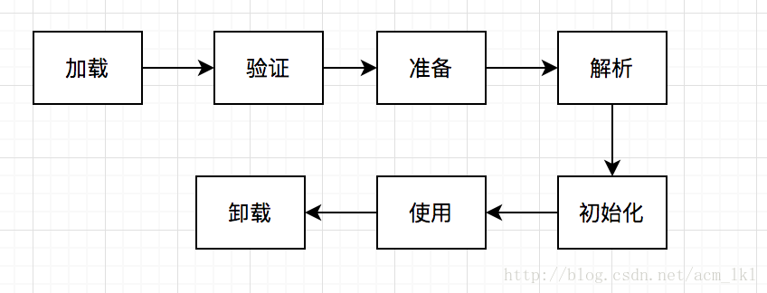

# 【12】JVM类加载机制
类从被加载到虚拟机内存开始，到卸载出内存为止，它的整个生命周期包括：加载、验证、准备、解析、初始化、使用和卸载7个阶段。
其中**验证、准备、解析三个阶段称之为连接**。

JVM没有对类加载的时机进行规定，但规定了类初始化的时机。JDK1.8遇到：
1. new指令创建；
2. 遇到反射reflect调用。
3. 子类初始化时；
4. 此类为主类时；

这四种情况时，会触发引用类的初始化。
## 12.1 加载
加载主要由三个基本动作完成：
1. 通过一个类的全限定名来获取定义此类的二进制字节流；
2. 将这个字节流所代表的静态存储结构转换为方法区的运行时数据结构；
3. 在内存中共生成一个代表这个类的java.lang.Class对象，作为方法区这个类的各种数据结构的访问入口。
> 上面的第一步，通过全限定名获取此类的二进制字节流，可以从jar包，网络，或是动态生成（例如Java动态代理ProxyGenerator.generateProxyClass()来为特定接口生成代理类的二进制字节流）。

## 12.2 连接（验证，准备，解析）
1. 验证
确认class符合Java语言的语义，检查各个类之间的二进制兼容性(比如final的类不用拥有子类等)，另外还需要进行符号引用的验证。

2. 准备
- 准备阶段是正式为**类变量（static修饰）分配内存并且设置类变量初始值**的阶段，**这里的初始值不是代码中指的初始值而是变量数据类型对应的零值(int为0,String为null等)。**这就是Java类为保证class可用，所做的默认初始化。
- 这些变量所使用的内存都将在**方法区**中进行分配。类变量指的是被static修饰的变量，不包括成员变量。**成员变量将会在对象实例化的时候随着对象一起分配在java堆中。（final修饰的并且直接赋值的成员变量，拥有跟类变量相同的处理方式。但是还是属于实例，顽皮的JDK优化，切记！！！！）**

3. 解析
解析阶段简单的来说就是虚拟机将常量池内的符号引用替换为直接引用的过程。

## 12.3 初始化
前面的阶段除在加载阶段用户应用程序通过自定义类加载器参与之外，其余动作完全由虚拟机主导。到初始化阶段才真正开始执行类中定义Java程序代码。
**初始化阶段执行静态变量的初始化，包括静态变量的赋值和静态初始化块。**
这些语句执行在类构造器<clinit>()方法中。<clinit>()方法自动收集以上语句并合并。
【注：】常说的静态代码块在类加载阶段执行其实是错误的，准确地说是在类初始化时执行。

## 12.4 使用（实例化）
使用new新建实例对象。会执行构造代码块和构造方法。为实例变量默认初始化或者赋值。
