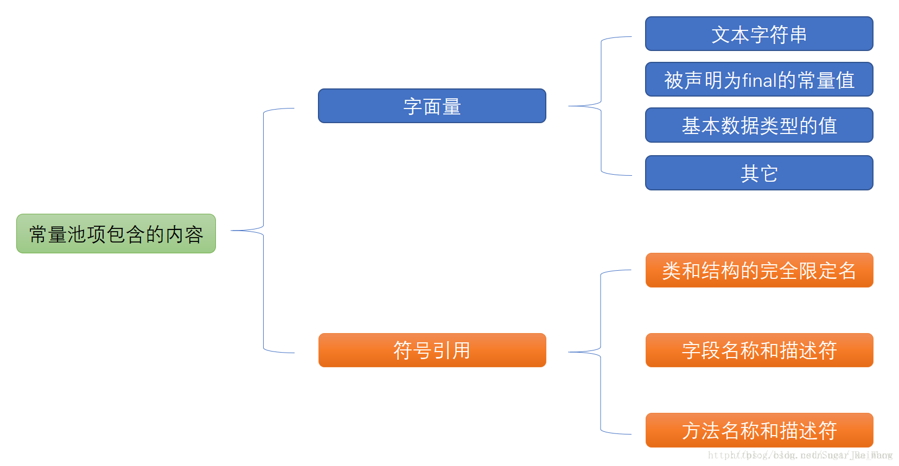

# 【13】方法区和常量池
https://blog.csdn.net/Jae_Wang/article/details/80291402

## 10.1 方法区
方法区是存储已经被虚拟机加载的类信息（class文件）、常量和静态变量。
在JDK1.7是在永久代，在JDK1.8是在原空间。

## 10.2 常量池
常量池分为**静态（class）常量池**和**运行时常量池**。
**运行时的常量池是属于方法区**的一部分，而**静态常量池是Class文件**的。
**常量池中存储的内容**：

### 10.2.1 静态常量池
> 用于存放编译器compile生成的各种字面量和符号引用。
> 符号引用存储的是字符串在常量池中的索引。

### 10.2.2 运行时常量池
> 静态常量池内容在**类初始化后**存入运行时常量池。相对于静态常量池，运行时常量池具有动态性，在程序运行的时候可能将新的常量放入运行时常量池中，比如使用String类的intern方法。
> 运行时常量池还包含**自动包装类Byte,Short,Integer,Long,Character在-128到127之间值，**这小部分也叫缓冲池。