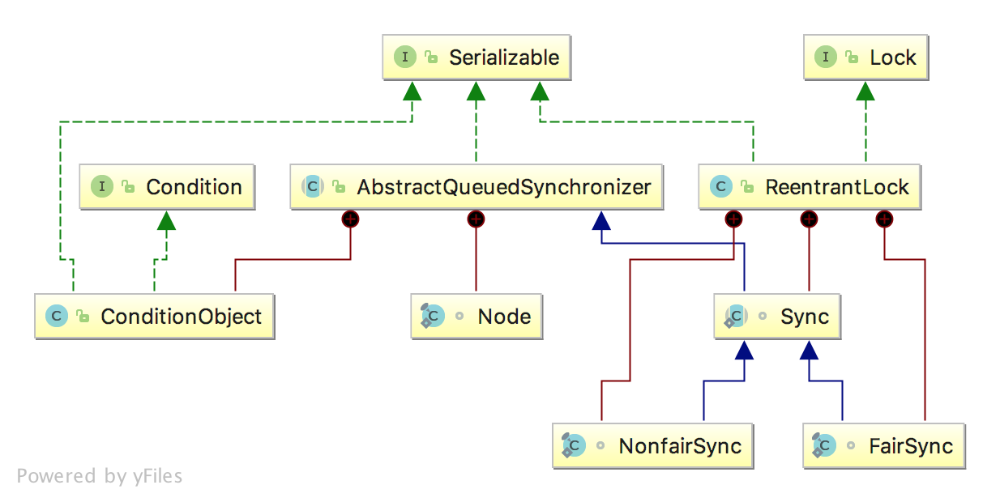
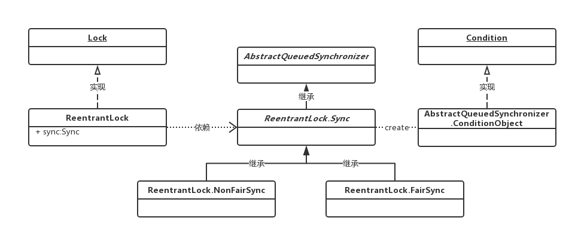

# 【24】ReentrantLock
ReentrantLock：是可重入锁，他是唯一实现了Lock接口的类。用来对临界资源进行加锁L
> 重入锁:指的是线程在获得锁之后，再次获取该锁不需要阻塞，而是直接关联一次计数器增加重入次数。


下图：斜体为抽象类,下横线为接口

**总结**：
> - ReentrantLock实现了Lock,Serializable接口
> - ReentrantLock.Sync(是**ReentrantLock的静态内部类**)继承了**AQS**（AbstractQueuedSynchronizer）
> - ReentrantLock持有（依赖）ReentrantLock.Sync对象(实现锁功能)
> - ReentrantLock.NonfairSync和ReentrantLock.FairSync继承了ReentrantLock.Sync

Lock方法：
```
public interface Lock {
	//上锁(不响应Thread.interrupt()直到获取锁)
    void lock();
	//上锁(响应Thread.interrupt())
    void lockInterruptibly() throws InterruptedException;
	//尝试获取锁(以nonFair方式获取锁)
    boolean tryLock();
  	//在指定时间内尝试获取锁(响应Thread.interrupt(),支持公平/二阶段非公平)
    boolean tryLock(long time, TimeUnit unit) throws InterruptedException;
	//解锁
    void unlock();
	//获取Condition
    Condition newCondition();
}
```
ReentrantLock实现：
```
public class ReentrantLock implements Lock｛
    //锁具体实现
    private final Sync sync;
    //根据传入参数选择FairSync公平锁或NonfairSync非公平锁实现
    public ReentrantLock(boolean fair) {
            sync = fair ? new FairSync() : new NonfairSync();
    }
    public void lock() {
        sync.lock();
    }
｝
```

## ReentrantLock与Synchronized

