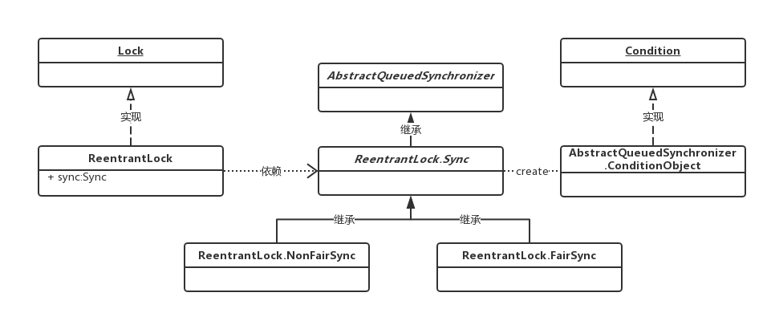
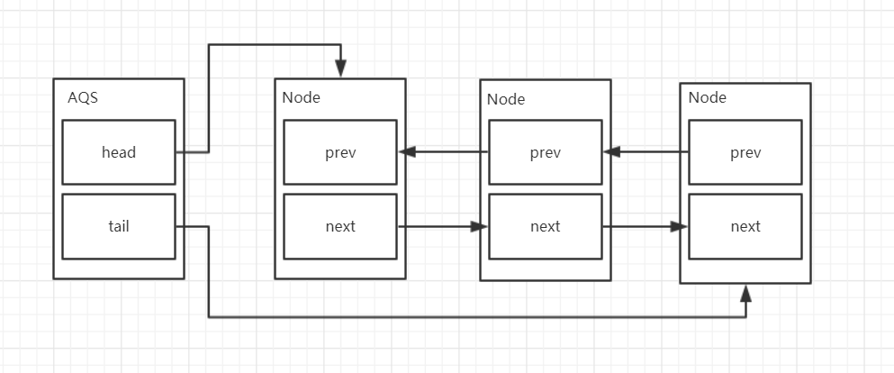
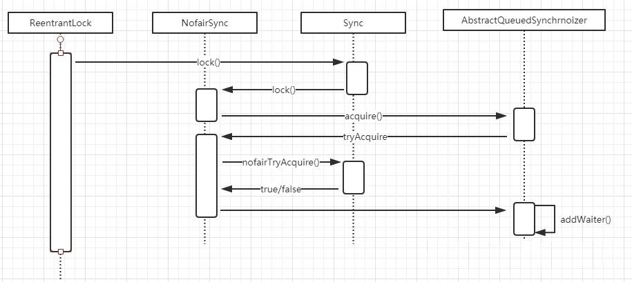

# 【25】AQS原理
AQS全称为AbstractQueuedSynchronizer，它提供了一个**FIFO双向队列**，用来实现同步锁以及其他涉及到并发功能的核心组件。

> AQS是一个抽象类，主要是通过继承的方式来使用，它本身没有实现任何的同步接口，仅仅是定义了同步状态的获取以及释放的方法来提供自定义的同步组件。

## 25.1 AQS内部实现
> **AQS的实现依赖内部的同步队列,也就是FIFO的双向队列，AQS中结点保存的是一个一个请求指定资源的线程**。


> 如果当前线程竞争锁失败，那么AQS会把当前线程以及等待状态信息构造成一个Node加入到同步队列中，同时再阻塞该线程。当获取锁的线程释放锁以后，会从队列中唤醒一个阻塞的节点(线程)。
> head指针指向当前获得锁的线程。

**NonFairSync和FairSync分别是非公平锁和公平锁的具体实现。**
非公平锁在请求锁时，先使用CAS的方式尝试获取锁，失败后才会用`acquire`方法加入队列等待。时序图如下：


## 25.2 CAS(CompareAndSwap)机制
CAS是一种基于乐观锁的操作。它有三个操作数，内存值V，预期值A，更新值B。当且仅当A和V相同时，才会把V修改成B，否则什么都不做。
```
V.compareAndSet(A,B)
```

### CAS工作原理
CAS工作原理就是**UnSafe类**和**自旋锁**。
> **自旋锁**：是指当一个线程在获取锁的时候，如果锁已经被其它线程获取，那么该线程将循环等待，然后不断的判断锁是否能够被成功获取，直到获取到锁才会退出循环。
> **UnSafe类**：可以直接在JVM层面通过对象的偏移地址获取对象在内存中的变量。

1. 首先，通过UnSafe来查找要使用的对象。
2. 然后**通过自旋锁，获得对象的使用权。**不通过就会一直循环查看，浪费资源。

```
AtomicInteger atomicInteger = new AtomicInteger(5);
System.out.println(atomicInteger.compareAndSet(5,50));
```
```
 public final int getAndIncrement() {
        //调用unsafe来获取对象。
        return unsafe.getAndAddInt(this, valueOffset, 1);
    }
```
```
public final int getAndAddInt(Object var1, long var2, int var4) {
        int var5;
        do {
            var5 = this.getIntVolatile(var1, var2);
        } while(!this.compareAndSwapInt(var1, var2, var5, var5 + var4));
        return var5;
    }
```

### CAS缺点
> 1. 如果CAS获取自旋锁失败，会一直进行尝试，浪费cpu资源。
> 2. ABA问题，内存变量由A变为了B，然后又变为A，此时CAS不能察觉值的改变。
> 3. 只能保证一个共享变量的原子性。