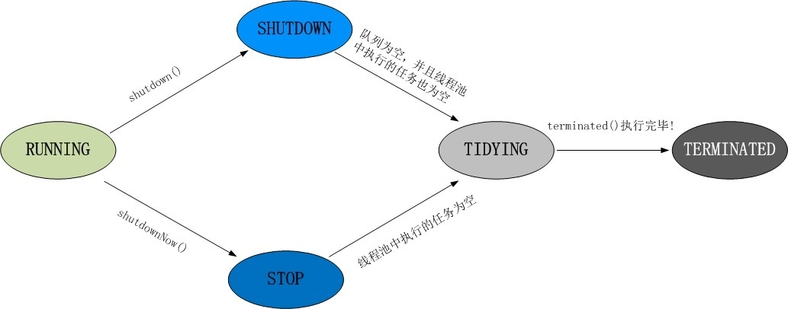

# 【26】线程池
常见的缓冲池有：
> `newCachedThreadPool`:无限线程池，corePoolSize为0，maximumPoolSize则是int最大值。
> `newFixedThreadPool`:创建固定大小的线程池,超出的线程会在队列中等待.corePoolSize、maximumPoolSize相同，都是设定值。
> `newScheduledThreadPool`:创建一个定长线程池，支持定时及周期性任务执行。corePoolSize是自定义的，而maximumPoolSize则是int最大值。
> `newSingleThreadExecutor`:创建一个单线程化的线程池，保证所有任务按照指定顺序(FIFO, LIFO, 优先级)执行。corePoolSize和maximumPoolSize都是1。
> 这些缓冲池是以**聚合**的方式在`Executors`类中。除了`newScheduledThreadPool`是继承自`ThreadPoolExecutor`，其他三个内部都是`ThreadPoolExecutor`的多态实现。

## 26.1 ThreadPoolExecutor
所以重点关注`ThreadPoolExecutor`类。
```
public ThreadPoolExecutor(int corePoolSize,int maximumPoolSize,long keepAliveTime,TimeUnit unit,BlockingQueue<Runnable> workQueue,RejectedExecutionHandler handler)
```
> `corePoolSize`:线程池的基本大小。
> `maximumPoolSize`:线程池数量的最大值。
> `keepAliveTime` 和 `unit`:线程空闲后的存活时间。
> `workQueue`:存放线程的阻塞队列。
> `handler`:当队列和最大线程池都满了之后的饱和拒绝策略。

## 26.2 线程池中的线程状态
> RUNNING:运行状态，指可以接受任务阻塞队列里的任务.
> SHUTDOWN:调用`shutdown`方法，<u>不再接受新任务了，但是阻塞队列里的任务得执行完毕。</u>
> STOP:调用`shutdownNow`方法，<u>不再接受新任务，同时抛弃阻塞队列里的所有任务并中断所有正在执行任务。</u>
> TIDYING:所有任务都执行完毕。线程池和任务队列都为空的时候.
> TERMINATED:调用`terminate`方法，终止状态。
> 

1. **线程状态的实现源码分析**
```
//用来标记线程池状态（高3位），线程个数（低29位）熟悉的自旋锁！！
//默认是RUNNING状态，线程个数为0
private final AtomicInteger ctl = new AtomicInteger(ctlOf(RUNNING, 0));

//高3位用来表示线程池状态，后面 29位用来记录线程池线程个数。
private static final int COUNT_BITS = Integer.SIZE - 3;
private static final int CAPACITY   = (1 << COUNT_BITS) - 1;

//（高3位）：11100000000000000000000000000000
private static final int RUNNING    = -1 << COUNT_BITS;
//（高3位）：00000000000000000000000000000000
private static final int SHUTDOWN   =  0 << COUNT_BITS;
//（高3位）：00100000000000000000000000000000
private static final int STOP       =  1 << COUNT_BITS;
//（高3位）：01000000000000000000000000000000
private static final int TIDYING    =  2 << COUNT_BITS;
//（高3位）：01100000000000000000000000000000
private static final int TERMINATED =  3 << COUNT_BITS;
```

2. **线程池执行顺序**
poolSize：线程池中当前线程的数量。
> 1. 如果poolSize<corePoolSize，新增加一个线程处理新的任务。
> 2. 如果poolSize=corePoolSize，新任务会被放入阻塞队列等待。
> 3. 如果阻塞队列的容量达到上限，且这时poolSize<maximumPoolSize，新增线程来处理任务。
> 4. 如果阻塞队列满了，且poolSize=maximumPoolSize，那么线程池已经达到极限，会根据**饱和(拒绝)策略**`RejectedExecutionHandler`拒绝新的任务。

3. **线程的超时退出**
判断条件：
```
(poolSize > corePoolSize || allowCoreThreadTimeOut)
```
> 1. 如果poolSize>corePoolSize，则该参数不论true还是false，都允许超时退出。
> 2. `allowCoreThreadTimeOut`是否允许核心线程超时退出。false：且poolSize<=corePoolSize，线程池都会保证这些核心线程处于存活状态，不会超时退出。true：则不论poolSize的大小，都允许超时退出。

**keepAliveTime**：
如果一个线程处在空闲状态的时间超过了该属性值，就会因为超时而退出。是否允许超时退出则取决于上面的逻辑。