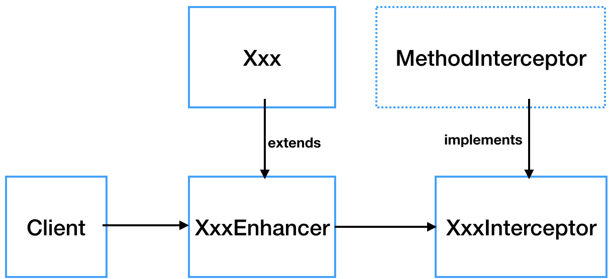

### 【9】Java动态代理
> 代理的作用：
> - 可以隐藏委托类的具体实现
> - 可以实现客户和委托类的解耦，并在不修改委托类的情况下做一些增强处理。
#### 9.1 静态代理
##### 9.1.1 静态代理原理
> 1. 静态代理需要手动编写代理类，也需要实现委托接口；
> 2. 将委托类注入代理类中；
> 3. 在代理类中，增强委托类中的方法（加入before，after等方法细节）。
> 4. 静态代理可以通过聚合来实现，让代理类持有一个委托类的引用即可。

> 总结：静态代理的局限在于运行前必须编写好代理类,一旦委托接口中存在成百上千的方法，这时候代理类就会存在大量冗余代码。
#### 9.2 动态代理
> Java虚拟机类加载过程主要分为五个阶段：加载、验证、准备、解析、初始化。
> **动态代理**就是想办法，根据接口或目标对象，计算出代理类的字节码，然后再加载到JVM中使用。
> 常用两种实现动态代理方式：
> - 通过实现接口的方式 -> JDK动态代理
> - 通过继承类的方式 -> CGLIB动态代理
##### 9.2.1 JDK动态代理
> JDK动态代理主要涉及两个类：`java.lang.reflect.Proxy` 和 `java.lang.reflect.InvocationHandler`
> 1. `java.lang.reflect.InvocationHandler`：
> `Object invoke(Object proxy, Method method, Object[] args) `定义了代理对象调用方法时希望执行的动作，用于集中处理在动态代理类对象上的方法调用。
> 2. `java.lang.reflect.Proxy`：
> `static Object newProxyInstance(ClassLoader loader, Class<?>[] interfaces, InvocationHandler h)` 构造实现指定接口的代理类的一个新实例，所有方法会调用给定处理器对象的 invoke 方法


> **【使用步骤】：**
> 1. 定义逻辑处理对象`XxxHandler`，并实现 `InvocationHandler` 接口；在 `XxxHandler` 中维护一个目标对象，这个对象是被代理的对象（真实主题角色）；在 `invoke` 方法中编写方法调用的逻辑处理。
```
// 这里定义了Loghandler逻辑处理对象。
public class LogHandler implements InvocationHandler {
    Object target;  // 被代理的对象，实际的方法执行者

    public LogHandler(Object target) {
        this.target = target;
    }
    @Override
    public Object invoke(Object proxy, Method method, Object[] args) throws Throwable {
        before();
        // 调用 target 的 method 方法
        Object result = method.invoke(target, args);  
        after();
        return result;  // 返回方法的执行结果
    }
    // 调用invoke方法之前执行
    private void before() {
        System.out.println(String.format("log start time [%s] ", new Date()));
    }
    // 调用invoke方法之后执行
    private void after() {
        System.out.println(String.format("log end time [%s] ", new Date()));
    }
}
```
> 2. 在控制层动态生成代理累对象。
```
public class Client2 {
    public static void main(String[] args) throws IllegalAccessException, InstantiationException {
        // 设置变量可以保存动态代理类，默认名称以 $Proxy0 格式命名
  //System.getProperties().setProperty("sun.misc.ProxyGenerator.saveGeneratedFiles", "true");
        // 1. 创建被代理的对象，UserService接口的实现类
        UserServiceImpl userServiceImpl = new UserServiceImpl();
        // 2. 获取对应的 ClassLoader
        ClassLoader classLoader = userServiceImpl.getClass().getClassLoader();
        // 3. 获取所有接口的Class，这里的UserServiceImpl只实现了一个接口UserService，
        Class[] interfaces = userServiceImpl.getClass().getInterfaces();
        // 4. 创建一个将传给代理类的调用请求处理器，处理所有的代理对象上的方法调用
        //这里创建的是一个自定义的日志处理器，须传入实际的执行对象 userServiceImpl
        InvocationHandler logHandler = new LogHandler(userServiceImpl);
        /*
        5.根据上面提供的信息，创建代理对象 在这个过程中，
               a.JDK会通过根据传入的参数信息动态地在内存中创建和.class 文件等同的字节码
               b.然后根据相应的字节码转换成对应的class，
               c.然后调用newInstance()创建代理实例
		 */
        UserService proxy = (UserService) Proxy.newProxyInstance(classLoader, interfaces, logHandler);
        // 调用代理的方法
        proxy.select();
        proxy.update();
        
        // 保存JDK动态代理生成的代理类，类名保存为 UserServiceProxy
        ProxyUtils.generateClassFile(userServiceImpl.getClass(), "UserServiceProxy");
    }
}
```
> 原理如下：
> - `XxxProxy` 继承了 Proxy 类，并且实现了被代理的所有接口
> - 类和所有方法都被 public final 修饰，所以代理类只可被使用，不可以再被继承
> - 每个方法都有一个 Method 对象来描述，Method 对象在static静态代码块中创建，以 m + 数字 的格式命名
> - 调用方法的时候通过 `super.h.invoke(this, m1, (Object[])null)`; 调用，其中的 `super.h.invoke` 实际上是在创建代理的时候传递给 `Proxy.newProxyInstance` 的 `LogHandler` 对象，它继承 `InvocationHandler` 类，负责实际的调用处理逻辑。

#### 9.2.2 CGLIB动态代理
> CGLIB代理步骤：
> 1. 创建Enhancer增强器。
> 2. 为增强器设置超类`setSuperclass(Xxx)`即要代理的目标对象Xxx。CGLIB通过这样继承的方式实现动态代理。
> 3. 设置拦截对象`setCallback(XxxInterceptor)`，拦截对象`XxxInterceptor`实现了`MethodInterceptor`接口
> 4. 通过create()创建代理类对象。



```
public class Target{
    public void f(){
        System.out.println("Target f()");
    }
    public void g(){
        System.out.println("Target g()");
    }
}

public class MyInterceptor implements MethodInterceptor {
    /**
     * @param object 表示要进行增强的对象
     * @param method 表示拦截的方法
     * @param objects 数组表示参数列表，基本数据类型需要传入其包装类型，如int-->Integer、long-Long、double-->Double
     * @param methodProxy 表示对方法的代理，invokeSuper方法表示对被代理对象方法的调用
     * @return 执行结果
     * @throws Throwable
     */
    @Override
    public Object intercept(Object obj, Method method, Object[] args, MethodProxy proxy) throws Throwable {
        System.out.println("I am intercept begin");
        //Note: 此处一定要使用proxy的invokeSuper方法来调用目标类的方法
        proxy.invokeSuper(obj, args);
        System.out.println("I am intercept end");
        return null;
    }
}

public class Test {
    public static void main(String[] args) {
        //用于保存生成的反编译代码
        System.setProperty(DebuggingClassWriter.DEBUG_LOCATION_PROPERTY, "F:\\code");
         //实例化一个增强器，也就是cglib中的一个class generator
        Enhancer eh = new Enhancer();
         //设置目标类
        eh.setSuperclass(Target.class);
        // 设置拦截对象
        eh.setCallback(new MyInterceptor());
        // 生成代理类并返回一个实例
        Target t = (Target) eh.create();
        t.f();
        t.g();
    }
}
```
> 输出
```
log start time [Fri Dec 21 00:06:40 CST 2018] 
UserDao 查询 selectById
log end time [Fri Dec 21 00:06:40 CST 2018] 
log start time [Fri Dec 21 00:06:40 CST 2018] 
UserDao 更新 update
log end time [Fri Dec 21 00:06:40 CST 2018] 
```
> 也可以输入多个拦截对象，通过CallbackFilter回调过滤器，来对不同的方法执行不同的回调逻辑，或者根本不执行回调。
```
public class DaoFilter implements CallbackFilter {
    @Override
    public int accept(Method method) {
        if ("f".equals(method.getName())) {
            // Callback 列表第1个拦截器
            return 0;   
        }
        // Callback 列表第2个拦截器，return 2 则为第3个，以此类推
        return 1;   
    }
}
```
测试加入：
```
// 设置多个拦截器，NoOp.INSTANCE是一个空拦截器，不做任何处理
enhancer.setCallbacks(new Callback[]{logInterceptor, logInterceptor2, NoOp.INSTANCE});   
enhancer.setCallbackFilter(new DaoFilter());
```

#### 9.2.3 JDK动态代理与CGLIB动态代理对比
> 1. JDK动态代理基于Java反射机制实现，必须要实现了接口的业务类才能用这种办法生成代理对象。JDK动态代理之所以只能代理接口是因为代理类本身已经extends了Proxy，而java是不允许多重继承的，但是允许实现多个接口。
> 2. CGLIB基于ASM机制实现，通过生成业务类的子类作为代理类。
> 3. CGLib在创建代理对象时所花费的时间却比JDK多得多，所以对于单例的对象，因为无需频繁创建对象，用CGLib合适，反之，使用JDK方式要更为合适一些。
> 4. 同时，由于CGLib由于是采用动态创建子类的方法，对于final方法，无法进行代理。