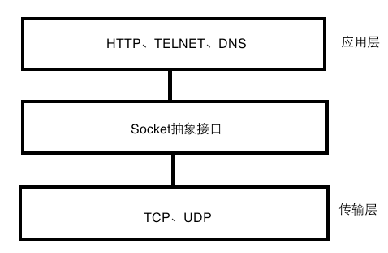

# 【9】HTTP，SOCKET，TCP之间关系

- TCP为传输层协议，用来发送，接受数据包。HTTP是应用层协议用来解析传输层接收到的数据包。
- SOCKET是传输层协议的抽象，是基于连接的。其唯一标识是{源ip，源端口，目的ip，目的端口，协议（TCP/UDP）}五元组。而传输层协议的唯一标识是{源ip，源端口，目的ip，目的端口}四元组。
- 在传输层连接的四元组相同时，可以通过协议的不同复用一个端口形成一个新的socket连接。但是这样复用端口的而协议不同的socket连接还是要属于同一个主进程。
- 应用层与传输层之间一般都使用socket接口来实现。这样一个五元组标识一个socket连接。
## 【socket小结：】
- Socket是一个针对TCP和UDP编程的接口，你可以借助它建立TCP连接等等。而TCP和UDP协议属于传输层 。  
- 而http是个应用层的协议，它实际上也建立在TCP协议之上。  (HTTP是轿车，提供了封装或者显示数据的具体形式；Socket是发动机，提供了网络通信的能力。)
- Socket是对TCP/IP协议的封装，Socket本身并不是协议，而是一个调用接口（API），通过Socket，我们才能使用TCP/IP协议。Socket的出现只是使得程序员更方便地使用TCP/IP协议栈而已，是对TCP/IP协议的抽象，从而形成了我们知道的一些最基本的函数接口。