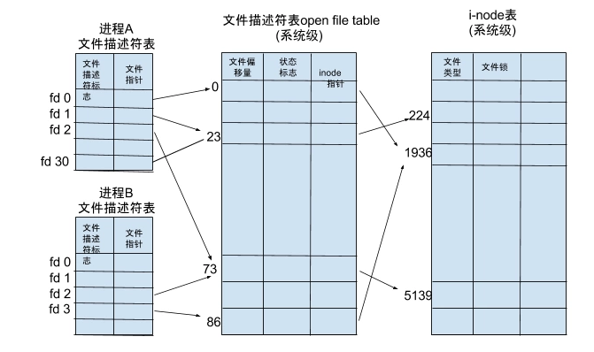

# 【1】Linux的文件描述符
## 1.1 概述
> 在Linux系统中一切皆可以看成是文件，文件又可分为：
> 普通文件、目录文件、链接文件和设备文件。
> **文件描述符**（file descriptor）：是内核为了高效管理已被打开的文件所创建的索引，其是一个非负整数（通常是小整数），用于指代被打开的文件，所有执行I/O操作的系统调用都通过文件描述符。程序刚刚启动的时候，0是标准输入，1是标准输出，2是标准错误。如果此时去打开一个新的文件，它的文件描述符会是3。

> 文件描述符和文件的对应关系：
> 
> 不同的文件描述符也会指向同一个文件。相同的文件可以被不同的进程打开也可以在同一个进程中被多次打开。打开的文件描述符数量是系统内存的10%。

## 1.2 文件描述符，文件打开表

每个进程会维护自身的一个文件描述符表，索引序号从0开始，存储文件指针。系统内核会维护一个系统级的文件描述符表，存储所有内核打开的文件描述符详细信息，包括文件偏移状态等信息。进程的文件指针指向系统级打开文件表。
i-node表存储文件类型和文件锁等文件控制信息及文件的物理地址。