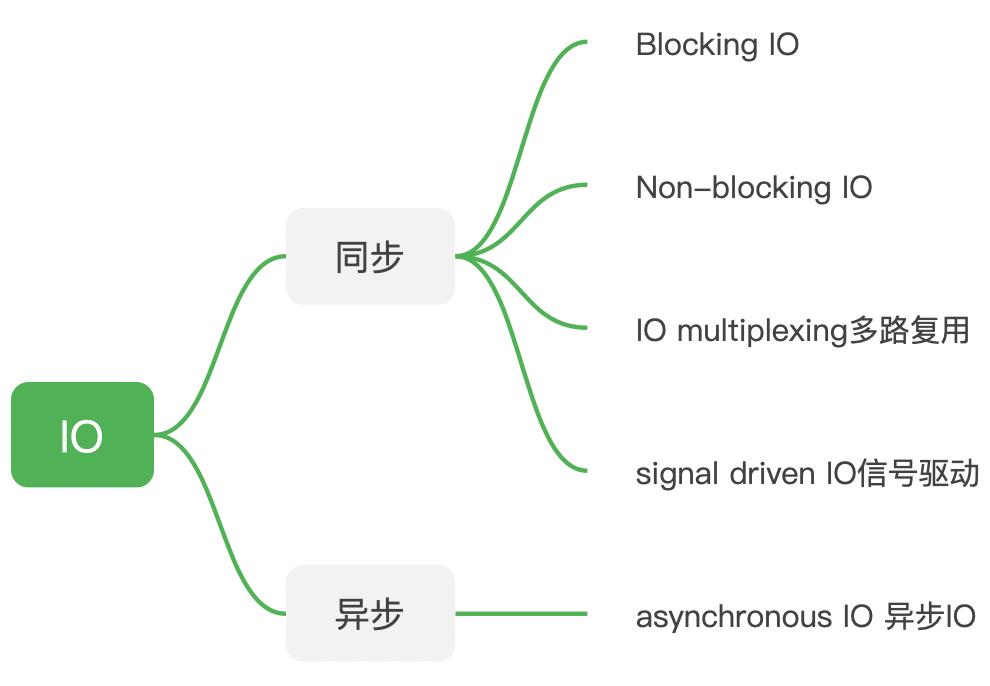
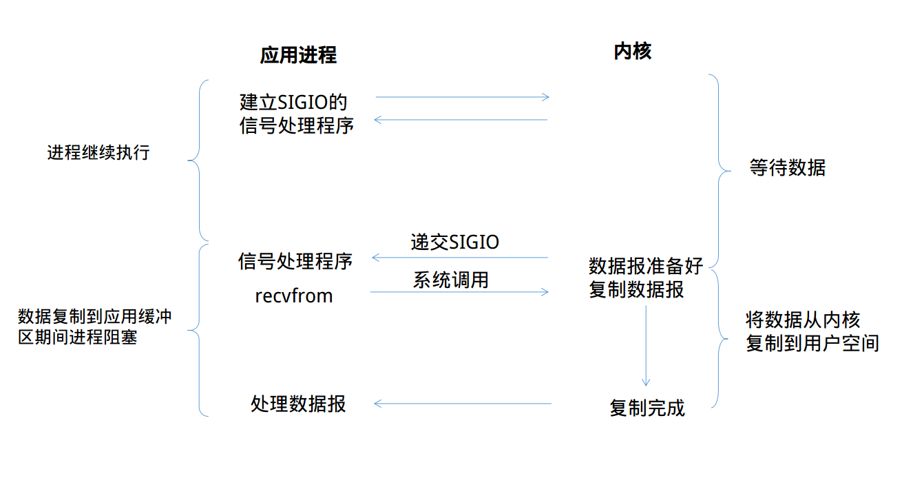

# 【2】Linux系统的IO模型
## 2.1 IO的概念和步骤
> IO操作是从端口或者磁盘中读取数据，或者向端口和磁盘写入数据。
> 步骤：
> 1. 等待数据准备（数据写入内核缓冲区）；
> 2. 将内核缓冲区数据拷贝到用户进程。

## 2.2 IO的类型和阻塞类型

> 同步：这些IO都会在第二步时被process阻塞。
> 异步：当进程发起IO操作之后，就直接返回再也不理睬了，直到kernel发送一个信号，告诉进程说IO完成。

### 阻塞类型
- 阻塞：会在调用阻塞io时阻塞住，一直到操作完成。只有BIO为阻塞，其他都在第一阶段立刻返回。
- 非阻塞：在kernel还在准备数据的情况下，会立刻返回。

### 2.2.1 Blocking IO
> 也叫同步阻塞IO（BIO），blocking IO的特点就是在IO执行的两个阶段都被block了。
> 

### 2.2.2 Non-blocking IO
> 也叫同步非阻塞IO（NIO），当用户进程发出read操作时，如果kernel中的数据还没有准备好，那么它并不会block用户进程，而是立刻返回一个error。用户进程其实是需要不断的主动询问kernel数据好了没有。
> 

### 2.2.3 IO multiplexing
> IO多路复用，用户进程调用select、poll、epoll不断轮询所负责的所有socket，当某个socket有数据到达了，就通知用户进程。IO多路复用的最大优点在于单个process可以处理多个网络连接的IO。
> 
> mutilplexing和blocking io没什么差别，事实上，还更差一些。因为这里需要使用两个system call (select 和 recvfrom)，而blocking IO只调用了一个system call (recvfrom)。但是，**用select的优势在于它可以同时处理多个connection。**（多说一句。所以，如果处理的连接数不是很高的话，使用select/epoll的web server不一定比使用multi-threading + blocking IO的web server性能更好，可能延迟还更大。select/epoll的优势并不是对于单个连接能处理得更快，而是在于能处理更多的连接。）
> IO multiplexing实际中，对于每一个socket，一般都设置成为non-blocking，但是，如上图所示，整个用户的process其实是一直被block的。只不过process是被select这个函数block，而不是被socket IO给block。

### 2.2.4 Singnal Driven信号驱动
> 信号驱动由于在大量IO操作时可能会因为信号队列溢出导致没法通知——这个是一个非常严重的问题。所以不常用。
> 信号驱动只在第二步的时候会被阻塞。

### 2.2.5 Asynchronous IO异步
> 用户进程发起read操作之后，立刻就可以开始去做其它的事。而另一方面，从kernel的角度，当它受到一个asynchronous read之后，首先它会立刻返回，所以**不会对用户进程产生任何block**。
> **kernel会等待数据准备完成，然后将数据拷贝到用户内存**，当这一切都完成之后，kernel会给用户进程发送一个**signal**，告诉它read操作完成了。

