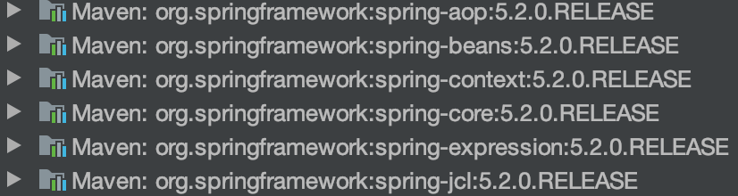
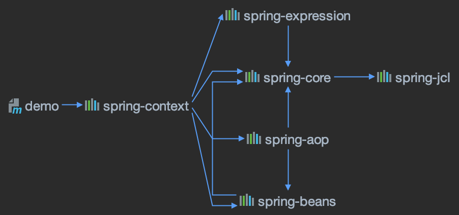
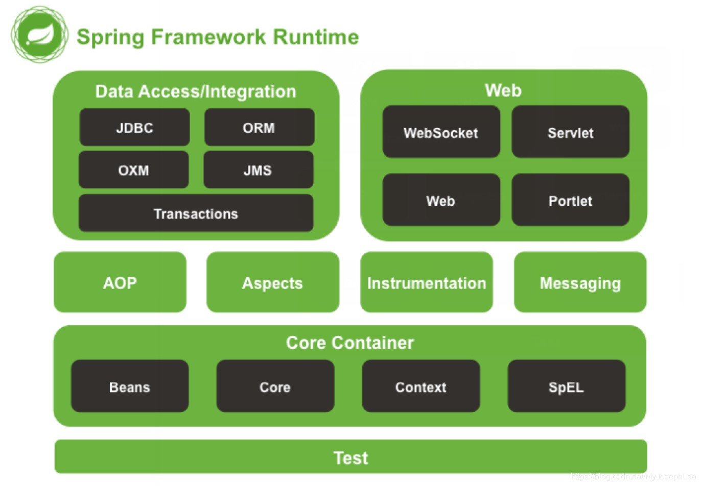

# 【2】Spring核心容器
> 
> 加入dependencies：
```
<dependency>
      <groupId>org.springframework</groupId>
      <artifactId>spring-context</artifactId>
      <version>5.2.0.RELEASE</version>
</dependency>
```
> 则会导入如下几个包：
> 
> 查看依赖关系：
> 
> 这些依赖即为Spring得核心容器。
> 

## 2.1核心容器的组成
> **Core**：实现了SpringIoC功能，用配置的方式管理Beans之间的依赖关系，BeanFactory接口是Spring框架的核心接口，它实现了容器许多核心的功能。
* * *
> **Beans**：用户编写的类，由容器创建和管理。代表可重用的组件。
* * *
> **SpEL**：表达式语言用于查询和管理运行期的对象，支持设置和获取对象属性，调用对象方法、操作数组、集合等。还提供了逻辑表达式运算、变量定义等功能·使用它就可以方便地通过表达式串和 Spring IOC 容器进行交互。
* * *
> **Context**：构建于Core模块之上，扩展了 BeanFactory 的功能，添加了 i18n 国际化、 Bean生命周期控制、框架事件体系、资源加载透明化等多项功能。此外，该模块还提供了许多企业级服务的支持，如邮件服务、任务调度、 JNDI 定位、 EJB 集成、远程访门等。

