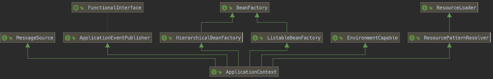

# 【3】Spring核心接口ApplicationContext
> ApplicationContext是 Context 模块的核心接口。
> 查看其继承关系：
> 

> 继承自BeanFactory，用来创建Beans。
> 继承自ResourceLoader，用来加载xml等资源
> 继承自FunctionalInterface，分发事件。

## 3.1 ApplicationContext的实现类
> ClassPathXmlApplicationContext:加载类路径下的配置文件。
> FileSystemXmlApplicationContext:加载磁盘任意路径下的配置文件。
> AnnotationConfigApplicationContext:用于读取注解来创建容器的。